# Analysis

An Analysis tells the solver **how to seek the next valid model state** and **how many steps to take**. It brings the numerical choices for one solve into a single managed object: constraint enforcement, equation ordering, linear solution, nonlinear iteration, convergence checking, state advancement, and the solve loop itself.

The physical model has already defined its nodes, elements, constraints, loading, and damping. Analysis does not replace those definitions. It chooses the numerical strategy used to solve them.

## Mental Model

At every analysis step, the solver must advance the model, form equations, solve them, update the trial state, and decide whether equilibrium has been reached. The six analysis components divide those responsibilities without making them independent of one another.

```mermaid
flowchart LR
    model["Assembled and loaded model"] --> handler["Constraint handler<br/>enforce relationships"]
    handler --> numberer["Numberer<br/>order equations"]
    numberer --> system["System<br/>solve linear equations"]
    system --> algorithm["Algorithm<br/>update trial state"]
    algorithm --> test["Convergence test<br/>accept or iterate"]
    test --> integrator["Integrator<br/>advance load or time"]
    integrator --> solve["Analysis<br/>run the solve loop"]

    classDef stage stroke-width:1px;
    classDef result stroke-width:2px;
    class model,handler,numberer,system,algorithm,test,integrator stage;
    class solve result;
```



This diagram is a learning sequence, not a claim that each operation runs only once. During a nonlinear step, the algorithm, system, and convergence test may cycle several times before the integrator can accept the state and advance.

## One Analysis, Seven Decisions

| Decision | Responsibility | Question to ask |
| --- | --- | --- |
| Constraint handler | Enforces SP and MP relationships in the equation system. | How should the solver represent the model's kinematic constraints? |
| Numberer | Assigns equation numbers to unconstrained degrees of freedom. | What ordering suits the matrix structure and execution mode? |
| System | Stores and solves the linearized equations. | What matrix solver is appropriate for this model? |
| Algorithm | Controls the nonlinear iteration and tangent updates. | How should the trial state move toward equilibrium? |
| Convergence test | Measures whether an iterative step is acceptable. | What quantity, tolerance, and iteration limit define convergence? |
| Integrator | Defines the state increment for static or transient response. | How should load, displacement, or time advance? |
| Analysis | Selects the solve family and controls the step loop. | Is the solve static, transient, or variable transient, and when should it stop? |

The components form one numerical strategy. A faster algorithm is not useful if its convergence test accepts a poor state, and a sophisticated time integrator cannot compensate for an unsuitable time step or linear solver.

???+ note "Model constraints and the analysis handler are different"
    `model.constraint.sp` and `model.constraint.mp` define the physical kinematic conditions: which motion is fixed and which nodes must move together. `model.analysis.constraint` creates the numerical handler that tells OpenSees how to enforce those already-defined conditions. Creating a transformation handler does not create a rigid diaphragm, an equal-DOF relation, or a fixed support.

## Continue The Loaded Model

The model from [Loading](loading.md) is assembled, constrained, and has a managed lateral-loading pattern. We will now define a static strategy that advances that loading in ten equal increments.

### Step 1: Choose Constraint Enforcement

The model contains both SP constraints and an MP equal-DOF relationship, so use the transformation handler:

```python
handler = model.analysis.constraint.transformation()
```

This choice concerns enforcement, not the definition of those constraints. Different models may require a different handler, particularly when constraint relationships or numerical conditioning change.

### Step 2: Organize And Solve The Equations

Choose reverse Cuthill-McKee ordering and a general banded system for this compact teaching model:

```python
numberer = model.analysis.numberer.rcm()
system = model.analysis.system.bandgeneral()
```

The numberer changes equation ordering without changing the physical model. The system then stores and solves the linearized equations in that order. Large sparse or parallel models usually warrant a different system; the correct choice depends on matrix properties, scale, and the OpenSees build being used.

### Step 3: Define Iteration And Acceptance

Use Newton iteration and accept a step when the residual-force norm satisfies the selected tolerance:

```python
algorithm = model.analysis.algorithm.newton()
test = model.analysis.test.normunbalance(
    tol=1.0e-6,
    max_iter=30,
    print_flag=0,
)
```

The algorithm proposes corrections. The test judges those corrections. They should be selected together: changing the algorithm can alter convergence behavior, while changing the test changes what Femora asks OpenSees to regard as converged.

???+ warning "Convergence is a modeling decision"
    A step that reaches its tolerance is numerically accepted; that does not automatically prove the result is physically accurate. Tolerance, iteration limit, step size, constitutive behavior, and response quantities should be checked together.

### Step 4: Advance The Static State

A static integrator controls how the load state advances. Ten increments of `0.1` take the reference loading from zero to a total load factor of one:

```python
integrator = model.analysis.integrator.loadcontrol(incr=0.1)
```

The integrator does not contain the load itself. The pattern defines the loading; the static integrator advances the load factor used while solving it.

### Step 5: Build The Cohesive Analysis

Pass the six components to the static factory and define the solve length:

```python
static_analysis = model.analysis.static(
    name="lateral_static",
    constraint_handler=handler,
    numberer=numberer,
    system=system,
    algorithm=algorithm,
    test=test,
    integrator=integrator,
    num_steps=10,
)
```

`static_analysis` is now one managed solver configuration. When executed later, it emits the component commands, creates a static OpenSees analysis, performs ten analysis steps, and then wipes the analysis configuration without wiping the physical model.

???+ note "Creating an Analysis does not run it"
    The factory validates and manages the analysis object. It does not immediately call OpenSees. The [Process](process.md) concept later explains how a managed Analysis is placed into the ordered solver workflow.

## Static And Transient Analyses

Static and transient analyses use the same constraint handler, numberer, system, algorithm, and convergence-test roles. Their essential difference is how the integrator advances the state and how the analysis loop measures progress.

=== "Static"

    Static analysis advances a load or displacement state with a `StaticIntegrator`. It requires `num_steps`.

    ```python
    static_integrator = model.analysis.integrator.loadcontrol(incr=0.1)

    static_analysis = model.analysis.static(
        name="gravity",
        constraint_handler=handler,
        numberer=numberer,
        system=system,
        algorithm=algorithm,
        test=test,
        integrator=static_integrator,
        num_steps=10,
    )
    ```

=== "Constant-step transient"

    Transient analysis advances physical model time with a `TransientIntegrator`. Supply a positive `dt` and choose either `num_steps` or `final_time`.

    ```python
    dynamic_integrator = model.analysis.integrator.newmark(
        gamma=0.5,
        beta=0.25,
    )

    transient_analysis = model.analysis.transient(
        name="earthquake",
        constraint_handler=handler,
        numberer=numberer,
        system=system,
        algorithm=algorithm,
        test=test,
        integrator=dynamic_integrator,
        dt=0.01,
        num_steps=1000,
    )
    ```

=== "Ramped-step transient"

    A regular transient analysis can vary `dt` linearly from `dt_min` to `dt_max`. This form uses `num_steps`; omit `dt` because the range defines the step size.

    ```python
    ramped_transient = model.analysis.transient(
        name="ramped_earthquake",
        constraint_handler=handler,
        numberer=numberer,
        system=system,
        algorithm=algorithm,
        test=test,
        integrator=dynamic_integrator,
        num_steps=1000,
        dt_min=0.001,
        dt_max=0.01,
    )
    ```

???+ note "Time series and analysis stepping have separate jobs"
    A loading time series defines the value available at model time `t`. The transient analysis decides which times the solver visits. Choose `dt`, the input sampling interval, and the frequencies of interest as one numerical-resolution decision, but do not treat them as the same setting.

## Variable Transient Analysis

`model.analysis.variable_transient(...)` represents OpenSees' variable-transient analysis family. Its interface requires an initial `dt`, lower and upper step bounds, and `jd`, the desired iteration count used by the adaptive strategy. It also requires exactly one stopping rule: `num_steps` or `final_time`.

```python
variable_analysis = model.analysis.variable_transient(
    name="adaptive_earthquake",
    constraint_handler=handler,
    numberer=numberer,
    system=system,
    algorithm=algorithm,
    test=test,
    integrator=dynamic_integrator,
    dt=0.01,
    dt_min=0.001,
    dt_max=0.02,
    jd=8,
    num_steps=1000,
)
```

???+ warning "Current exporter limitation"
    Femora currently validates and stores the variable-transient parameters, but `Analysis.to_tcl()` does not yet forward `dt_min`, `dt_max`, and `jd` to the generated `analyze` command. The optional `num_sublevels` and `num_substeps` recovery settings are likewise stored but not emitted. Until those exporter paths are completed, do not assume these options provide adaptive stepping or retry behavior in exported Tcl. A regular transient analysis with `dt_min` and `dt_max` does export its documented linear time-step ramp.

## How To Reason About The Choices

Start with the physics and model scale, then choose a coherent numerical stack:

1. Identify the constraints that must be enforced and choose a compatible handler.
2. Choose equation ordering and a system solver appropriate for matrix structure, model size, and serial or parallel use.
3. Pair the nonlinear algorithm with a convergence measure that reflects the response being solved.
4. Choose a static or transient integrator based on what must advance.
5. Select step size and stopping conditions based on loading resolution, nonlinearity, and required accuracy.
6. Verify convergence and response sensitivity rather than relying on one successful run.

???+ tip "Change one numerical decision at a time"
    When diagnosing convergence, keep a known configuration and vary one item deliberately: step size, algorithm, test, or system. Replacing the entire stack at once may produce a successful run without revealing which assumption caused the original failure.

???+ warning "Integrator families are enforced"
    `model.analysis.static(...)` requires a static integrator. `model.analysis.transient(...)` and `model.analysis.variable_transient(...)` require a transient integrator. Femora raises an error when those families are mixed.

???+ warning "Use one transient stopping rule"
    A transient analysis accepts `num_steps` or `final_time`, not both. Constant-step transient analysis uses `dt`; the linear-ramp form uses both `dt_min` and `dt_max` with `num_steps` and omits `dt`.

## API Reference

The generated API reference is the source for available factories, exact signatures, defaults, validation rules, and solver-specific options.

<div class="grid cards" markdown>

-   :material-cog-play-outline: **[Analysis Manager](../reference/core/AnalysisManager/index.md)**

    Static, transient, variable-transient, lifecycle, and update methods.

-   :material-tune-variant: **[Analysis Components](../reference/components/analysis/index.md)**

    Constraint handlers, numberers, systems, algorithms, convergence tests, integrators, and the Analysis component.

</div>

## Related Concepts

* [Loading](loading.md): Define the patterns and histories evaluated as model time or load factor advances.
* [Constraints](constraints.md): Define physical SP and MP relationships before selecting their numerical handler.
* [Damping](damping.md): Define energy dissipation evaluated during dynamic response.
* [Recorders and Actions](recorders-and-actions.md): Define observations and runtime transitions around analyses.
* [Process](process.md): Place managed analyses into the final ordered workflow.
