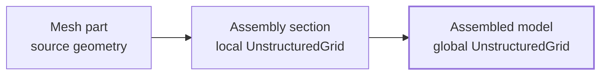

# The Assembled Model

`model.assembler.assemble()` turns the prepared assembly sections into one model-wide mesh: `model.assembled_mesh`. This is the boundary between independent source geometry and the complete mesh that Femora uses for constraints, interfaces, visualization, export, and analysis.

The result is a PyVista `UnstructuredGrid`. Understanding that container, and the data Femora carries through it, makes assembly behavior inspectable instead of hidden.

## The Mesh Container

A PyVista [`UnstructuredGrid`](https://docs.pyvista.org/api/core/_autosummary/pyvista.UnstructuredGrid.html) stores a finite-element mesh in three connected parts:

| Part | Meaning in Femora | Examples |
| --- | --- | --- |
| Points | Coordinates that become solver nodes during export. | A beam end, a solid corner, a foundation node. |
| Cells | Topological elements that reference points. | A line, quad, tetrahedron, or brick. |
| Data arrays | Values attached to every point, every cell, or the whole mesh. | `ndf`, `Mass`, `MaterialTag`, `Core`. |

Point data has one value per point. Cell data has one value per cell. Field data belongs to the whole mesh and is used for small global lookup tables rather than element-by-element values. PyVista documents these associations in its [data model](https://docs.pyvista.org/user-guide/data_model.html).

```python
mesh = model.assembled_mesh

print(mesh.n_points)
print(mesh.n_cells)
print(mesh.point_data.keys())
print(mesh.cell_data.keys())
print(mesh.field_data.keys())
```

???+ note "Points are not cells"
    A point is a coordinate record. A cell is an element that refers to one or more points. When Femora merges points, it updates cell connectivity so cells share the retained point. It does not merge cells or change their element formulation.

## Three Mesh States

Femora has three useful levels of mesh information. Keeping these levels separate explains both the memory model and the assembly process.



### 1. Mesh Parts: Source Geometry

A mesh part is a modeling object, not automatically the final mesh. The base `MeshPart` API permits `mesh=None`, leaving room for parametric or lazy sources that keep only their definition until geometry is needed.

Current built-in volume, surface, and line mesh parts generate and retain a local source mesh when they are created, so they can be plotted and assembled immediately. In other words, `mesh=None` is an extension point, not a current memory optimization for those built-ins. `general.external_mesh` reads or accepts a complete external mesh, and `general.composite` directly wraps a user-supplied `UnstructuredGrid`. These advanced mesh parts may already contain point or cell data supplied by the user.

At this level, a mesh is local to one mesh part. It has no model-wide point numbering and no final connection to neighboring mesh parts.

???+ tip "Use a general or composite mesh deliberately"
    Imported and composite meshes are the path when you already have a complete `UnstructuredGrid` or need to preserve cell-level tags. Parametric mesh parts are the clearer and lighter interface when Femora can generate the geometry from parameters.

### 2. Assembly Sections: Local Assembled Meshes

Creating an assembly section gathers its selected mesh parts, adds Femora metadata, combines their local meshes, and optionally performs the section-level point merge. The result is `section.mesh`, a `pyvista.UnstructuredGrid` that represents one local part of the future model.

This is where separate source meshes first become a common grid. A section preserves cell formulations and records enough point and cell metadata for the later global merge and solver export. It is not yet the final solver mesh: model-wide merging and assembly-time interfaces may still change the final result.

### 3. The Assembled Model: One Global Mesh

Calling `model.assembler.assemble()` combines the section meshes without merging points first. It gives each section a distinct partition-label range, marks whether each section may participate in the final merge, and then performs the optional model-wide point merge. Finally, event-driven interfaces can inspect or extend the assembled mesh.

The result is `model.assembled_mesh`: one `UnstructuredGrid` containing the final point connectivity, cell metadata, partition labels, and any cells created by assembly-time interfaces.

## Data Created For An Assembly Section

Femora normalizes every mesh part before adding it to an assembly section. If a standard mesh part has no pre-existing tags, Femora supplies the tags from its element template. A composite mesh can provide its own `ElementTag`, `MaterialTag`, or `SectionTag`; Femora preserves those existing arrays.

The following arrays are present on a normal `section.mesh` after section assembly. Public metadata is appropriate for model code, plotting, selections, and export. Internal assembly data is available for debugging but may change as assembly internals evolve. See [Mesh Data Schema](../technical-reference/mesh-data-schema.md) for current dtypes, shapes, and export field data.

### Point Data

| Array | Status | Meaning |
| --- | --- | --- |
| `ndf` | Public metadata | Degrees of freedom for the point. It controls merge compatibility and later node export. |
| `Mass` | Public metadata | Nodal mass vector. Missing mass is created as zeros. |
| `MeshPartTag_pointdata` | Provenance | Mesh-part tag associated with the point before any later merge. |

### Cell Data

| Array | Status | Meaning |
| --- | --- | --- |
| `ElementTag` | Public metadata | Element template or composite element tag. |
| `MaterialTag` | Public metadata | Material tag for the cell. |
| `SectionTag` | Public metadata | Section tag for the cell, when relevant to its element formulation. |
| `Region` | Public metadata | Region assigned by the mesh part. |
| `MeshPartTag_celldata` | Provenance | Mesh-part source tag for the cell. |
| `FemoraPartTag` | Provenance | Consecutive source-part identifier for visualization and exported provenance. |
| `FemoraPartKind` | Provenance | Numeric source-kind identifier, such as mesh part, interface, absorber, or generated data. |
| `Core` | Public metadata | Local partition label. It is `0` until the section is divided into more than one partition. |

Section-level merging uses `ndf` as its merge key. Points must be within the section tolerance and have compatible `ndf` values before they can collapse. When `mass_merging="sum"`, Femora rebuilds `Mass` from the temporary merge map so the retained point receives the summed mass.

???+ note "Temporary assembly data is removed"
    PyVista creates a temporary field-data array named `PointMergeMap` while a merge is being performed. Femora uses it to rebuild summed nodal mass, then removes it. It is not a supported post-assembly array.

## What Happens During Final Assembly

The final assembly pass works in a deliberate order:

1. Femora copies the completed section meshes into one temporary `MultiBlock` collection.
2. It offsets later sections' `Core` values so separately partitioned sections have distinct labels.
3. It combines those blocks into one `UnstructuredGrid` without point merging.
4. It adds `MergeInFinal` point data from each section's `merge_in_final` setting.
5. When `assemble(merge_points=True)` is used, it snaps points within tolerance and merges only points allowed by the final merge key.
6. It rebuilds summed nodal mass when requested, removes the temporary merge map, then emits assembly events.
7. Interfaces and other event-driven components can inspect, add to, or resolve partition-sensitive data on the resulting mesh.

The key distinction is scope: `section.merge_points` controls topology inside one section, while `assemble(merge_points=True)` controls the model-wide pass across completed sections. `section.merge_in_final=False` protects that section's points from participating in the global merge.

## Final Assembled-Mesh Data

The assembled mesh retains the section arrays above, plus these final-assembly arrays when applicable. Current dtypes and shapes are listed in [Mesh Data Schema](../technical-reference/mesh-data-schema.md).

### Point Data Added Or Used By Final Assembly

| Array | Status | Meaning |
| --- | --- | --- |
| `MergeInFinal` | Public metadata | `1` when the source section allows its points in final merging; `0` when it does not. |
| `FinalMergeKey` | Internal assembly data | Merge key constructed from `ndf` and `MergeInFinal` during a global point merge. It is present when final point merging runs, but model code should not depend on it. |

`ndf`, `Mass`, and `MeshPartTag_pointdata` remain point data after final assembly. Their values may change because several compatible source points can become one final point. With the default `mass_merging="sum"`, `Mass` is summed rather than averaged. For source selection after merging, use cell provenance (`MeshPartTag_celldata` or `FemoraPartTag`); a merged point does not necessarily have one unambiguous mesh-part owner.

### Cell Data Retained Or Extended By Final Assembly

| Array | Status | Meaning |
| --- | --- | --- |
| `ElementTag`, `MaterialTag`, `SectionTag`, `Region` | Public metadata | Element formulation and region metadata carried from the source section. |
| `MeshPartTag_celldata` | Provenance | Original mesh-part source tag for ordinary mesh-part cells. Generated cells may use `0` when no mesh part owns them. |
| `Core` | Public metadata | Globalized partition label after later sections receive their offsets. See [Partitioning](partitioning-and-parallel-execution.md) for its meaning. |
| `FemoraPartTag`, `FemoraPartKind` | Provenance | Provenance for ordinary mesh parts and cells created by interfaces, absorbers, or other generated sources. |

The exact final array set can grow when an interface adds cells or its own metadata. Inspect the mesh rather than assuming every advanced workflow produces the same arrays.

## Provenance During Export

`FemoraPartTag` and `FemoraPartKind` are compact cell provenance arrays. VTK export adds a field-data lookup table that maps those values to source names and kinds. The arrays, dtypes, and export timing are documented in [Mesh Data Schema](../technical-reference/mesh-data-schema.md).

## Inspecting The Model

Use the assembled mesh as the inspection boundary whenever you need to verify final topology, metadata, or partitioning.

```python
model.assembler.assemble()

mesh = model.assembled_mesh
print(f"points: {mesh.n_points}")
print(f"cells: {mesh.n_cells}")
print("point arrays:", list(mesh.point_data))
print("cell arrays:", list(mesh.cell_data))

model.assembler.plot(scalars="Core", show_edges=True)
```

For a local check before global assembly, inspect a section directly:

```python
section = model.assembler.create_section(
    meshparts=["soil", "pile"],
    merge_points=True,
)

print(section.mesh.n_points)
print(section.mesh.n_cells)
print(section.mesh.point_data.keys())
print(section.mesh.cell_data.keys())
```

## Related Concepts

* [Assembly](assembly.md): Create sections and control local and final point merging.
* [Partitioning](partitioning-and-parallel-execution.md): Assign section cells to solver subdomains.
* [Interfaces](interfaces.md): Define relationships that may modify the assembled mesh during assembly.
* [Tags and IDs](tags-and-ids.md): Understand the identifiers carried into the completed model.
* [Regions and Groups](regions-and-groups.md): Apply solver scope and select parts of the completed model.
