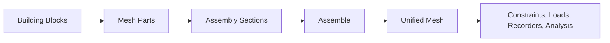

# Assembly

Assembly is the stage where Femora turns separate mesh parts into one global computational model. Before assembly, you have independent geometric pieces. After assembly, Femora has a unified mesh, consistent point metadata, partition labels, and the information needed for export, constraints, interfaces, recorders, and analysis.

For Femora, this is not a minor cleanup step. It is the point where geometric modeling becomes solver-ready structure.

## Mental Model

Think of modeling in Femora in two phases:

1. Before assembly, you define building blocks and mesh parts independently.
2. During assembly, Femora decides which points belong to the same physical node, which cells belong to which partition, and which event-driven components need to modify the assembled model.
3. After assembly, the model is ready for constraints, loading, recorders, export, and solution steps.



???+ tip "The big idea"
    Femora lets you model parts independently first, then connect them through assembly. In plain OpenSees, connected members usually need you to manage shared nodes explicitly. In Femora, geometric coincidence plus compatible metadata can create that connection for you.

## What An Assembly Section Is

An assembly section is the first place where Femora stops treating mesh parts as isolated pieces and starts treating them as a local model fragment. You can think of it as an intermediate workspace between "I created some geometry" and "I now have one solver-ready domain." Inside that workspace, Femora takes the mesh parts you selected, combines them, checks whether coincident points should collapse together, and prepares that portion of the model for partitioning and later global assembly.

That is why a section is more than a folder of mesh parts. It is where you decide how a specific part of the domain should behave before the full model is assembled. A frame region, a soil block, and a generated special zone may all belong to the same final model, but they do not always need to be combined in the same way or prepared with the same decomposition strategy.

In practice, creating a section is simply a matter of calling the assembler and naming the mesh parts that should be gathered together. For example, imagine you already created structural mesh parts such as `column`, `beam`, and `joint_zone`, and also created separate soil mesh parts such as `soil_layer_1` and `soil_layer_2`:

```python
frame_section = model.assembler.create_section(
    meshparts=["column", "beam", "joint_zone"],
    merge_points=True,
    num_partitions=1,
)

soil_section = model.assembler.create_section(
    meshparts=["soil_layer_1", "soil_layer_2"],
    merge_points=True,
    num_partitions=8,
    partitioner="kd-tree",
)
```

These calls do not run the full assembly yet. They create two local pre-assembly units that Femora will later use as ingredients in the final assembled model. This is the main idea: you first decide how to group your meshing objects, and only after that do you ask Femora to assemble the whole model.

## Why Femora Needs Assembly Sections

If Femora only exposed one global `assemble()` call with no sections, the model would still assemble, but you would lose the ability to shape that process. Every part of the domain would be forced through the same merge decisions and the same partitioning logic. That is usually too rigid for real models, especially when structural components, soil domains, interfaces, and generated regions do not play the same role.

Assembly sections solve that by letting you break the future model into meaningful pre-assembly chunks. In one section you might want aggressive local merging because the mesh parts are meant to become one continuous frame. In another section you might want to keep duplicated points until later, or keep that section out of the final global merge entirely. In that sense, an assembly section is both a geometric grouping unit and a domain-decomposition unit. It tells Femora not only what belongs together, but also how that portion of the model should enter the full assembled mesh.

## Nodes, Points, And What Actually Merges

This is the point where Femora's mesh language and OpenSees language meet. On the mesh side, Femora works with **points** and **cells** because the model is being built as a PyVista unstructured grid. On the solver side, OpenSees works with **nodes** and **elements**. During export, assembled mesh points become OpenSees nodes.

So when people say that Femora "merged nodes," that is only loosely true. What Femora actually merges during assembly are mesh points. The elements or cells are never collapsed into one another. Instead, different cells become connected because they end up sharing the same final point location, which later becomes the same exported node. That is why two independently created beam parts can become connected in the final model without you manually managing a shared node tag in advance.

## Point Merging In Femora

Point merging in Femora is intentionally stricter than "same coordinates means merge." Spatial coincidence is only the first check. Femora also looks at whether the points are compatible for the current merge pass and whether they are even allowed to participate in that pass. This matters because a geometrically touching model is not always a physically connected model.

The most important compatibility rule for most users is the nodal degree-of-freedom count, stored internally as `ndf`. A 3-DOF solid point and a 6-DOF beam point may occupy the same coordinates and still remain separate, because Femora recognizes that they represent different kinematic models. That is a protection feature. It prevents accidental connections between incompatible formulations and is one of the reasons Femora can safely assemble mixed domains such as solids and frame members.

In practice, a point merge happens only when three conditions line up: the points are close enough under the merge tolerance, their metadata is compatible, and the current section or global assembly pass allows them to merge. Once you understand those three ideas together, the rest of the assembly behavior becomes much easier to predict.

This is also the reason Femora lets you model connected parts independently. You can create one beam, create another beam separately, and place one end so it lands exactly on the other part where a connection should exist. If the discretized points really coincide and their metadata is compatible, assembly can turn those independent pieces into one connected structural path. In other words, Femora lets you describe the geometry first and lets assembly decide whether that geometry becomes continuity.

That benefit comes with an important modeling lesson: visual closeness is not enough. The relevant points must actually exist in the discretized mesh, and they must land within the merge tolerance. If you want one member to connect into the middle of another, the receiving mesh must already contain a point there, or be discretized so that one is created there during meshing. Assembly is powerful, but it still works on actual mesh topology, not just on what the eye expects from a drawing.

???+ note "Why this matters"
    This rule protects you from a common modeling error. A beam passing through a solid does not become connected just because coordinates touch. If the DOF model is different, Femora keeps them separate unless you intentionally connect them through another mechanism such as an interface.

The fastest way to understand point merging is to compare a few small models and watch what changes in the section topology.

Later, this section can also host interactive mesh views for each stage. The structure below stays consistent, but each example is placed under the concept it teaches.

???+ note "About the counts shown below"
    The point and cell counts are there on purpose. Assembly behavior becomes much easier to understand when you track what Femora keeps, what it merges, and what it only relabels. In these examples, the reported counts are the expected outcomes of the exact meshes created in the snippets.

## Point-Merging Examples

=== "Example 1: Connected frame parts"

    <div markdown="1" style="border: 1px solid var(--md-default-fg-color--lightest); border-radius: 12px; padding: 1rem 1rem 1.25rem; margin: 0.5rem 0 1rem;">

    This example stays at the **assembly-section** level. The goal is to show that the same two independent structural parts can produce different section meshes depending on whether section-level point merging is enabled.

    ```python
    from femora.core.model import Model

    def build_section(merge_points: bool):
        model = Model()

        section = model.section.beam.elastic(
            user_name="frame_sec",
            E=1.0,
            A=1.0,
            Iz=1.0,
            Iy=1.0,
        )
        transformation = model.transformation.transformation3d("Linear", 0, 1, 0)
        beam = model.element.beam.disp(
            ndof=6,
            section=section,
            transformation=transformation,
        )

        model.meshpart.line.single_line(
            user_name="column",
            element=beam,
            x0=0.0, y0=0.0, z0=0.0,
            x1=0.0, y1=0.0, z1=1.0,
            number_of_lines=4,
        )
        model.meshpart.line.single_line(
            user_name="beam",
            element=beam,
            x0=0.0, y0=0.0, z0=1.0,
            x1=1.0, y1=0.0, z1=1.0,
            number_of_lines=4,
        )

        return model.assembler.create_section(
            meshparts=["column", "beam"],
            merge_points=merge_points,
            tolerance=1e-5,
        )


    section_merge_true = build_section(True)
    section_merge_false = build_section(False)

    print("Expected counts")
    print("column: 5 points, 4 cells")
    print("beam: 5 points, 4 cells")
    print("raw combined: 10 points, 8 cells")
    print(
        "section with merge_points=True:",
        f"{section_merge_true.mesh.n_points} points, {section_merge_true.mesh.n_cells} cells",
    )
    print(
        "section with merge_points=False:",
        f"{section_merge_false.mesh.n_points} points, {section_merge_false.mesh.n_cells} cells",
    )
    ```

    ```text
    Results
    Expected counts
    column: 5 points, 4 cells
    beam: 5 points, 4 cells
    raw combined: 10 points, 8 cells
    section with merge_points=True: 9 points, 8 cells
    section with merge_points=False: 10 points, 8 cells
    ```

    **Visual summary**

    <div style="display: grid; grid-template-columns: repeat(auto-fit, minmax(220px, 1fr)); gap: 1rem; margin: 1rem 0;">
      <div style="border: 1px solid var(--md-default-fg-color--lightest); border-radius: 8px; overflow: hidden;">
        <div style="padding: 0.5rem; background: rgba(0,0,0,0.02); font-size: 0.85rem; border-bottom: 1px solid var(--md-default-fg-color--lightest);">Before section assembly: independent column and beam parts</div>
        <div style="aspect-ratio: 16/9; position: relative;">
          <iframe src="../../assets/assembly/connected_frame_before.html" style="width: 100%; height: 100%; border: none;"></iframe>
        </div>
      </div>
      <div style="border: 1px solid var(--md-default-fg-color--lightest); border-radius: 8px; overflow: hidden;">
        <div style="padding: 0.5rem; background: rgba(0,0,0,0.02); font-size: 0.85rem; border-bottom: 1px solid var(--md-default-fg-color--lightest);">Section 1 with merge_points=True: shared joint point merged</div>
        <div style="aspect-ratio: 16/9; position: relative;">
          <iframe src="../../assets/assembly/connected_frame_section_merge_true.html" style="width: 100%; height: 100%; border: none;"></iframe>
        </div>
      </div>
      <div style="border: 1px solid var(--md-default-fg-color--lightest); border-radius: 8px; overflow: hidden;">
        <div style="padding: 0.5rem; background: rgba(0,0,0,0.02); font-size: 0.85rem; border-bottom: 1px solid var(--md-default-fg-color--lightest);">Section 2 with merge_points=False: touching coordinates remain separate</div>
        <div style="aspect-ratio: 16/9; position: relative;">
          <iframe src="../../assets/assembly/connected_frame_section_merge_false.html" style="width: 100%; height: 100%; border: none;"></iframe>
        </div>
      </div>
    </div>

    Before section assembly, the column and beam are still independent mesh parts. They touch at `(0, 0, 1)`, but that joint still exists as two separate point records.

    When Femora builds the section, the only decision that changes the outcome here is `merge_points`. With `merge_points=True`, the shared joint collapses into one section-level point because the coordinates coincide and the `ndf` values are compatible. With `merge_points=False`, Femora keeps both point records even though the geometry touches.

    The important result is that the cell count stays the same in both cases. What changes is only the section topology at the joint: `9 points, 8 cells` for the merged case, and `10 points, 8 cells` for the non-merged case. That is why this example matters. It shows that an assembly section is not just a container for parts; it already controls whether independent pieces become topologically connected before any final global assembly step happens.

    </div>

=== "Example 2: Beam versus solid"

    <div markdown="1" style="border: 1px solid var(--md-default-fg-color--lightest); border-radius: 12px; padding: 1rem 1rem 1.25rem; margin: 0.5rem 0 1rem;">

    This example also stays at the **assembly-section** level. Here the lesson is different from Example 1: even when a beam and a solid overlap geometrically, changing `merge_points` does not change the section topology if their nodal DOF models are incompatible.

    ```python
    from femora.core.model import Model

    def build_section(merge_points: bool):
        model = Model()

        soil_material = model.material.nd.elastic_isotropic(
            user_name="soil",
            E=1.0,
            nu=0.3,
            rho=1.0,
        )
        brick = model.element.brick.std(ndof=3, material=soil_material)

        section = model.section.beam.elastic(
            user_name="beam_sec",
            E=1.0,
            A=1.0,
            Iz=1.0,
            Iy=1.0,
        )
        transformation = model.transformation.transformation3d("Linear", 0, 1, 0)
        beam = model.element.beam.disp(
            ndof=6,
            section=section,
            transformation=transformation,
        )

        model.meshpart.volume.uniform_rectangular_grid(
            user_name="soil_block",
            element=brick,
            region=None,
            x_min=-1.0, x_max=1.0,
            y_min=-1.0, y_max=1.0,
            z_min=-1.0, z_max=1.0,
            nx=2, ny=2, nz=2,
        )
        model.meshpart.line.single_line(
            user_name="pile_beam",
            element=beam,
            x0=-2.0, y0=-2.0, z0=-2.0,
            x1=2.0, y1=2.0, z1=2.0,
            number_of_lines=4,
        )

        return model.assembler.create_section(
            meshparts=["soil_block", "pile_beam"],
            merge_points=merge_points,
            tolerance=1e-5,
        )


    section_merge_true = build_section(True)
    section_merge_false = build_section(False)

    print("Expected counts")
    print("soil_block: 27 points, 8 cells")
    print("pile_beam: 5 points, 4 cells")
    print("raw combined: 32 points, 12 cells")
    print(
        "section with merge_points=True:",
        f"{section_merge_true.mesh.n_points} points, {section_merge_true.mesh.n_cells} cells",
    )
    print(
        "section with merge_points=False:",
        f"{section_merge_false.mesh.n_points} points, {section_merge_false.mesh.n_cells} cells",
    )
    ```

    ```text
    Results
    Expected counts
    soil_block: 27 points, 8 cells
    pile_beam: 5 points, 4 cells
    raw combined: 32 points, 12 cells
    section with merge_points=True: 32 points, 12 cells
    section with merge_points=False: 32 points, 12 cells
    ```

    **Visual summary**

    <div style="display: grid; grid-template-columns: repeat(auto-fit, minmax(220px, 1fr)); gap: 1rem; margin: 1rem 0;">
      <div style="border: 1px solid var(--md-default-fg-color--lightest); border-radius: 8px; overflow: hidden;">
        <div style="padding: 0.5rem; background: rgba(0,0,0,0.02); font-size: 0.85rem; border-bottom: 1px solid var(--md-default-fg-color--lightest);">Before assembly: separate parts</div>
        <div style="aspect-ratio: 16/9; position: relative;">
          <iframe src="../../assets/assembly/beam_vs_solid_before.html" style="width: 100%; height: 100%; border: none;"></iframe>
        </div>
      </div>
      <div style="border: 1px solid var(--md-default-fg-color--lightest); border-radius: 8px; overflow: hidden;">
        <div style="padding: 0.5rem; background: rgba(0,0,0,0.02); font-size: 0.85rem; border-bottom: 1px solid var(--md-default-fg-color--lightest);">merge_points=True: no merge</div>
        <div style="aspect-ratio: 16/9; position: relative;">
          <iframe src="../../assets/assembly/beam_vs_solid_section_merge_true.html" style="width: 100%; height: 100%; border: none;"></iframe>
        </div>
      </div>
      <div style="border: 1px solid var(--md-default-fg-color--lightest); border-radius: 8px; overflow: hidden;">
        <div style="padding: 0.5rem; background: rgba(0,0,0,0.02); font-size: 0.85rem; border-bottom: 1px solid var(--md-default-fg-color--lightest);">merge_points=False: no merge</div>
        <div style="aspect-ratio: 16/9; position: relative;">
          <iframe src="../../assets/assembly/beam_vs_solid_section_merge_false.html" style="width: 100%; height: 100%; border: none;"></iframe>
        </div>
      </div>
    </div>

    In this version, the beam extends beyond the solid so the reader can clearly see it pass through the host domain instead of disappearing inside one coarse cell. The solid is also discretized more finely, so the example reads like a real host block rather than a single brick.

    The key point is that `merge_points` does not change the outcome here. Femora still checks `ndf` before merging points. The solid contributes 3-DOF points and the beam contributes 6-DOF points, so the geometry is not merge-compatible even where coordinates overlap. Both section cases therefore keep the same topology: `41 points, 16 cells`.

    That is exactly the behavior you want. The beam does not accidentally attach itself to the solid just because coordinates overlap. If you need that relationship, you must create it intentionally through an interface or another explicit coupling strategy. This is a protection feature, not a limitation.

    </div>

## Two Levels Of Merging

Once the point-merging idea is clear, the next step is to understand that Femora does not make that decision only once. It can decide connectivity locally inside a section, and then make another decision later when all sections are brought together into the full model. Those are related decisions, but they are not the same decision.

The first merge level answers a local question: should the mesh parts inside this one section collapse onto one another where they coincide? That is the decision controlled by `merge_points` when the section is created. It is about the internal topology of that section before the rest of the model is considered.

The second merge level answers a global question: once all section meshes exist, should this section be allowed to merge with neighboring sections during the final assembled-model pass? That is where `merge_in_final` matters. A section may be perfectly valid on its own, but you may still want to keep its boundary points from collapsing into points that belong to other sections elsewhere in the model.

This is why the two options should be thought of separately. `merge_points` controls local cleanup and local continuity inside a section. `merge_in_final` controls whether that section participates in the later whole-model merge. When users confuse those two ideas, assembly behavior starts to feel mysterious. When they keep them separate, the model becomes much easier to reason about.

## Two Levels Of Merging Example

=== "Example 3: Local merge versus final merge"

    <div markdown="1" style="border: 1px solid var(--md-default-fg-color--lightest); border-radius: 12px; padding: 1rem 1rem 1.25rem; margin: 0.5rem 0 1rem;">

    This example combines both ideas on purpose. The left section uses local section merging, the right section does not, and then the full model compares what happens when the right section is excluded from or included in the final global merge. Everything uses only solids, so the reader sees the merge logic without beam-versus-solid `ndf` differences getting in the way.

    ```python
    from femora.core.model import Model

    def build_model(exclude_right_from_final_merge: bool):
        model = Model()

        soil_material = model.material.nd.elastic_isotropic(
            user_name="soil",
            E=1.0,
            nu=0.3,
            rho=1.0,
        )
        brick = model.element.brick.std(ndof=3, material=soil_material)

        model.meshpart.volume.uniform_rectangular_grid(
            user_name="left_a",
            element=brick,
            region=None,
            x_min=0.0, x_max=1.0,
            y_min=0.0, y_max=1.0,
            z_min=0.0, z_max=1.0,
            nx=1, ny=1, nz=1,
        )
        model.meshpart.volume.uniform_rectangular_grid(
            user_name="left_b",
            element=brick,
            region=None,
            x_min=1.0, x_max=2.0,
            y_min=0.0, y_max=1.0,
            z_min=0.0, z_max=1.0,
            nx=1, ny=1, nz=1,
        )
        model.meshpart.volume.uniform_rectangular_grid(
            user_name="right_a",
            element=brick,
            region=None,
            x_min=2.0, x_max=3.0,
            y_min=0.0, y_max=1.0,
            z_min=0.0, z_max=1.0,
            nx=1, ny=1, nz=1,
        )
        model.meshpart.volume.uniform_rectangular_grid(
            user_name="right_b",
            element=brick,
            region=None,
            x_min=3.0, x_max=4.0,
            y_min=0.0, y_max=1.0,
            z_min=0.0, z_max=1.0,
            nx=1, ny=1, nz=1,
        )

        left_section = model.assembler.create_section(
            meshparts=["left_a", "left_b"],
            merge_points=True,
            merge_in_final=True,
        )

        right_section = model.assembler.create_section(
            meshparts=["right_a", "right_b"],
            merge_points=False,
            merge_in_final=not exclude_right_from_final_merge,
        )

        model.assembler.assemble(merge_points=True)
        return left_section, right_section, model


    left_section_a, right_section_a, model_excluded = build_model(True)
    left_section_b, right_section_b, model_included = build_model(False)

    print("Results")
    print(
        "left section with merge_points=True:",
        f"{left_section_a.mesh.n_points} points, {left_section_a.mesh.n_cells} cells",
    )
    print(
        "right section with merge_points=False:",
        f"{right_section_a.mesh.n_points} points, {right_section_a.mesh.n_cells} cells",
    )
    print(
        "final assembled mesh with right section excluded:",
        f"{model_excluded.assembled_mesh.n_points} points, {model_excluded.assembled_mesh.n_cells} cells",
    )
    print(
        "final assembled mesh with both sections included:",
        f"{model_included.assembled_mesh.n_points} points, {model_included.assembled_mesh.n_cells} cells",
    )
    ```

    ```text
    Results
    left section with merge_points=True: 12 points, 2 cells
    right section with merge_points=False: 16 points, 2 cells
    final assembled mesh with right section excluded: 28 points, 4 cells
    final assembled mesh with both sections included: 20 points, 4 cells
    ```

    **Visual summary**

    <div style="display: grid; grid-template-columns: repeat(auto-fit, minmax(200px, 1fr)); gap: 1rem; margin: 1rem 0;">
      <div style="border: 1px solid var(--md-default-fg-color--lightest); border-radius: 8px; overflow: hidden;">
        <div style="padding: 0.5rem; background: rgba(0,0,0,0.02); font-size: 0.85rem; border-bottom: 1px solid var(--md-default-fg-color--lightest);">Left section: two touching solid mesh parts with merge_points=True</div>
        <div style="aspect-ratio: 16/9; position: relative;">
          <iframe src="../../assets/assembly/local_vs_final_merge_left_section.html" style="width: 100%; height: 100%; border: none;"></iframe>
        </div>
      </div>
      <div style="border: 1px solid var(--md-default-fg-color--lightest); border-radius: 8px; overflow: hidden;">
        <div style="padding: 0.5rem; background: rgba(0,0,0,0.02); font-size: 0.85rem; border-bottom: 1px solid var(--md-default-fg-color--lightest);">Right section: two touching solid mesh parts with merge_points=False</div>
        <div style="aspect-ratio: 16/9; position: relative;">
          <iframe src="../../assets/assembly/local_vs_final_merge_right_section.html" style="width: 100%; height: 100%; border: none;"></iframe>
        </div>
      </div>
      <div style="border: 1px solid var(--md-default-fg-color--lightest); border-radius: 8px; overflow: hidden;">
        <div style="padding: 0.5rem; background: rgba(0,0,0,0.02); font-size: 0.85rem; border-bottom: 1px solid var(--md-default-fg-color--lightest);">Final with right section excluded: section boundary stays duplicated</div>
        <div style="aspect-ratio: 16/9; position: relative;">
          <iframe src="../../assets/assembly/local_vs_final_merge_final_excluded.html" style="width: 100%; height: 100%; border: none;"></iframe>
        </div>
      </div>
      <div style="border: 1px solid var(--md-default-fg-color--lightest); border-radius: 8px; overflow: hidden;">
        <div style="padding: 0.5rem; background: rgba(0,0,0,0.02); font-size: 0.85rem; border-bottom: 1px solid var(--md-default-fg-color--lightest);">Final with both sections included: section boundary collapses</div>
        <div style="aspect-ratio: 16/9; position: relative;">
          <iframe src="../../assets/assembly/local_vs_final_merge_final_included.html" style="width: 100%; height: 100%; border: none;"></iframe>
        </div>
      </div>
    </div>

    The left section and right section are both valid on their own, but they do not behave the same internally. The left section uses `merge_points=True`, so its two touching mesh parts collapse onto one shared internal face and it finishes with `12 points, 2 cells`. The right section uses `merge_points=False`, so its touching mesh parts keep duplicated face points and it finishes with `16 points, 2 cells`.

    After that, the final global merge asks a different question: should the right section be allowed to blend into neighboring sections at all? If it is excluded, the shared boundary between left and right stays duplicated and the full model keeps `28 points, 4 cells`. If it is included, Femora merges both the right section's internal duplicated face and the cross-section boundary, so the final model drops to `20 points, 4 cells`.

    That is the way to think about `merge_in_final`. It is not a local cleanup switch. It is a boundary-of-participation switch for the final global merge. Use it when a section should keep its own topology relative to neighboring sections even though the geometry touches.

    </div>

## Assembly Section Options

The main options exposed by `model.assembler.create_section(...)` are:

| Option | Meaning | Typical use |
| --- | --- | --- |
| `meshparts` | Mesh part names included in the section | Define which parts belong together |
| `num_partitions` | Number of partitions for this section | Control parallel decomposition |
| `partitioner` | Partitioner name such as `kd-tree`, `geometric`, `morton`, `hilbert`, `metis` | Choose partitioning strategy |
| `merge_points` | Merge coincident points inside this section | Create continuity inside the section |
| `merge_in_final` | Allow this section to participate in final global merging | Keep some sections isolated from final collapse |
| `mass_merging` | How point mass is combined during merging | Usually `sum` |
| `tolerance` | Spatial tolerance used for merging | Control how strict coincidence must be |

The main options exposed by `model.assembler.assemble(...)` are:

| Option | Meaning |
| --- | --- |
| `merge_points` | Run the final global merge pass across sections |
| `mass_merging` | Control final mass handling during global point merge |
| `tolerance` | Final global merge tolerance |

## Partitioning Is Configured Per Section

Assembly sections also define whether their cells remain serial, stay together as one partition, or are divided into several subdomains. Use `num_partitions=0` to force serial behavior for a section, `1` to keep the whole section as one partition, or a larger value with an explicit `partitioner` to divide it.

```python
model.assembler.create_section(
    meshparts=["soil"],
    num_partitions=4,
    partitioner="metis",
)
```

Partitioning does not change geometry or element formulations. It assigns each cell a `Core` label that Femora carries into the assembled mesh. [Partitioning](partitioning-and-parallel-execution.md) explains the `0`, `1`, and multi-partition choices, algorithm differences, and result inspection.

## Common Mistakes

???+ warning "Assuming touching geometry is enough"
    Touching geometry is not enough by itself. Merge tolerance, actual discretized points, and compatible `ndf` all matter.

???+ warning "Forgetting that solids and frame elements usually carry different DOF models"
    A beam point and a solid point do not merge just because they occupy the same coordinates. That is usually correct behavior.

???+ warning "Using too-large merge tolerances"
    A large tolerance can collapse points that were meant to stay separate. Keep the tolerance physically meaningful for your mesh scale.

???+ warning "Expecting elements to merge"
    Femora merges points, not elements. A shared boundary can create continuity, but each cell still keeps its own element formulation.

## Related Concepts

* [Mesh Parts](mesh-parts.md): The geometric pieces that enter each assembly section.
* [Interfaces](interfaces.md): Components that can react to assembly events and modify the assembled model.
* [Partitioning](partitioning-and-parallel-execution.md): Decide how assembly sections are divided into subdomains.
* [The Assembled Model](assembled-model.md): The mesh, connectivity, and metadata produced by assembly.
* [Tags and IDs](tags-and-ids.md): Identifiers carried through assembly and export.
* [Regions and Groups](regions-and-groups.md): Physical scope before assembly and reusable selections afterward.
