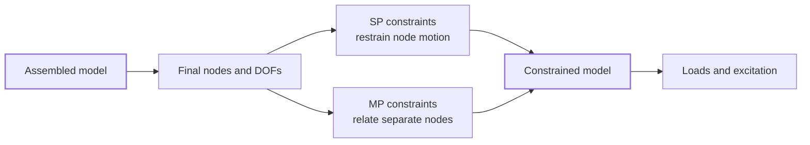
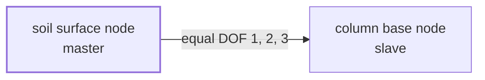

# Constraints

Assembly tells Femora which cells share points and which points remain separate. Constraints describe the motion allowed at those final nodes. They answer two practical questions:

* Which degrees of freedom must remain fixed?
* Which degrees of freedom at separate nodes must move together?

Femora keeps these decisions under `model.constraint`, with separate namespaces for single-point and multi-point constraints.



Constraints normally follow assembly because final node connectivity, node tags, coordinates, and `ndf` values are then known. Loads come afterward because they act on this constrained kinematic model.

## Two Constraint Families

### Single-Point Constraints

An **SP constraint** restrains selected degrees of freedom at one node or at every node on a coordinate boundary. A fixed soil base is an SP constraint because each selected node is restrained relative to the ground.

```text
free node:   ux, uy, uz may move
fixed node:  selected components cannot move
```

Use the `model.constraint.sp` namespace for these constraints.

### Multi-Point Constraints

An **MP constraint** relates motion at two or more separate nodes. One node acts as the master and one or more slave nodes follow it in the specified degrees of freedom. The nodes remain distinct; the constraint adds a kinematic relationship between them.

```text
master node motion ---- relationship ----> slave node motion
```

Use the `model.constraint.mp` namespace for equal-DOF relationships, rigid links, rigid diaphragms, and laminar boundaries.

???+ note "A constraint is not a point merge"
    Point merging changes mesh topology: compatible point records become one point. An MP constraint preserves separate nodes and relates only selected degrees of freedom. Use assembly merging when the parts should truly share a node. Use an MP constraint when the nodes must remain separate or have different `ndf` values.

## Read `dofs` Carefully

The two namespaces use `dofs` differently because they represent different OpenSees commands.

=== "SP constraints"

    An SP `dofs` value is a state vector. Each position represents one nodal degree of freedom:

    ```python
    dofs=[1, 1, 0]
    ```

    Here, `1` means fixed and `0` means free. For a three-DOF node, this restrains DOFs 1 and 2 while leaving DOF 3 free. The vector length must match the `ndf` of every targeted node.

=== "MP constraints"

    An MP `dofs` value lists the one-based DOF numbers that must be related:

    ```python
    dofs=[1, 2]
    ```

    This relates DOFs 1 and 2. It does not mean fixed/free, and omitted DOFs remain independent.

???+ warning "The same-looking list can mean something different"
    `dofs=[1, 1, 0]` is meaningful for an SP constraint because it is a fixed/free vector. Repeating `1` in an MP list does not express the same condition. For an MP constraint, write the selected DOF numbers once, such as `dofs=[1, 2]`.

## Continue The Soil-Structure Model

The model from [Regions and Groups](regions-and-groups.md) has already been assembled. Its soil block uses three translational DOFs, while its column and beam use line-element DOFs.

At the beam-column joint, the compatible points were merged during assembly. The beam and column already share one node, so no additional constraint is needed there.

At the soil-column contact, the coordinates coincide but the points have different `ndf` values. Femora correctly kept them separate. We can now decide explicitly how their motion should be related.

## Step 1: Restrain The Soil Base

The soil extends to the model's minimum Z coordinate. Fix all three translational DOFs on that global boundary:

```python
model.constraint.sp.fix_macro_z_min(
    dofs=[1, 1, 1],
    tol=1.0e-6,
)
```

For this three-DOF soil, the state vector fixes translation in X, Y, and Z. The macro boundary follows the assembled model's lower Z extent, so the constraint expresses the intended boundary rather than repeating its coordinate.

## Step 2: Couple The Column To The Soil

Use the mesh-part helper to find coincident points from the two assembled sources and create equal-DOF constraints for their shared translational motion:

```python
model.constraint.mp.equal_dof_between_meshparts(
    meshpart_master="soil",
    meshpart_slave="column",
    dofs=[1, 2, 3],
    tol=1.0e-6,
)
```

The resulting relationship can be read as:



The two nodes remain separate and retain their own `ndf` values. Only translations 1, 2, and 3 are tied; rotational DOFs at the column remain independent. This is different from the beam-column joint, where assembly replaced two compatible point records with one shared node.

## Before Moving To Loads

At this point the example has three different forms of connectivity:

| Location | How motion is established |
| --- | --- |
| Beam-column joint | Compatible points merged into one node during assembly |
| Soil-column contact | Separate nodes related by an MP equal-DOF constraint |
| Soil base | Soil nodes restrained by an SP constraint |

This distinction is central to building reliable models. Geometry determines where nodes are located, assembly determines which compatible points become one node, and constraints determine how the remaining nodes may move.

???+ note "Constraints and interfaces act at different stages"
    Interfaces are declared before assembly when a relationship must inspect or modify the assembly process. `model.constraint` describes the kinematics of the completed model. An interface may generate solver relationships internally, but ordinary post-assembly boundary conditions belong to the constraint manager.

???+ note "Model constraints are not the analysis constraint handler"
    `model.constraint.sp` and `model.constraint.mp` define physical kinematic conditions. The analysis constraint handler controls how OpenSees enforces those conditions numerically. That solver configuration belongs to [Analysis](analysis.md).

## API Reference

The API reference contains the available constraint types, exact signatures, targeting options, tolerances, return values, and manager lifecycle methods.

<div class="grid cards" markdown>

-   :material-lock-outline: **[SP Constraint Manager](../reference/core/SpConstraintManager/index.md)**

    Node-specific, coordinate-plane, and assembled-boundary fixity methods.

-   :material-vector-link: **[MP Constraint Manager](../reference/core/MPConstraintManager/index.md)**

    Equal-DOF, rigid-link, rigid-diaphragm, mesh-part matching, and laminar-boundary methods.

-   :material-code-braces: **[Constraint Components](../reference/components/constraint/index.md)**

    The SP and MP component classes represented by the manager APIs.

</div>

## Related Concepts

* [Regions and Groups](regions-and-groups.md): Organize the assembled model before assigning behavior.
* [Damping](damping.md): Assign energy dissipation to model regions.
* [Assembly](assembly.md): Understand when points merge and when they remain separate.
* [Interfaces](interfaces.md): Define relationships that participate in assembly.
* [Loading](loading.md): Apply forces or excitation to the constrained model.
