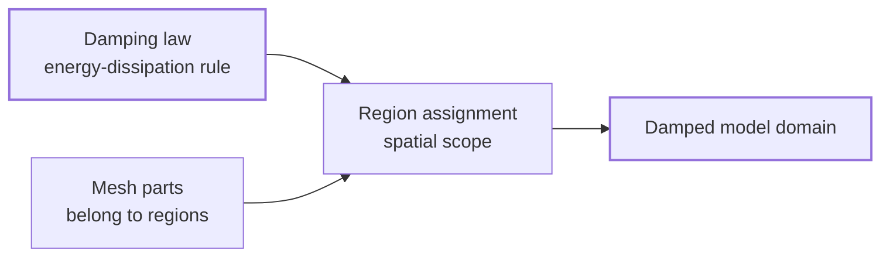
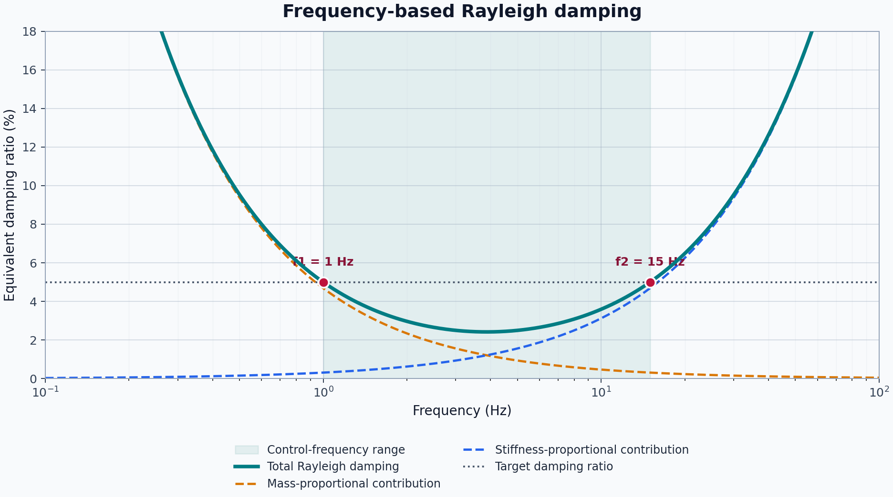
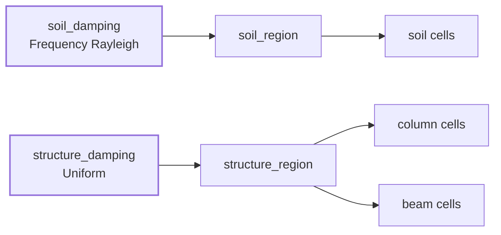

# Damping

Damping represents energy dissipation that is not already captured by the material and element formulations. In a dynamic model, it controls how vibration decays and how strongly different frequency ranges are attenuated.

A complete damping definition answers two separate questions:

```text
What mathematical damping law should be used?
Which part of the model should receive that law?
```

Femora keeps these decisions separate. `model.damping` creates and manages the damping law, while a region determines its spatial scope.

## The Mental Model



Creating a damping object does not apply it anywhere. Assigning that object to a region completes the model-side definition. For an explicit non-global element region, Tcl export resolves its assembled cells to element tags and appends the damping option to that region. Damping-related Tcl is emitted before the ordered process.

???+ note "Damping is model behavior, not a process step"
    Damping changes the equations used by the model. It is exported before the ordered process and is not added with `model.process.add_step(...)`. The Process concept later explains the objects that are explicitly ordered during a solver workflow.

## Creation And Assignment Are Different

The damping manager owns damping objects, gives them tags, and keeps them available for reuse:

```python
soil_damping = model.damping.frequency_rayleigh(
    user_name="soil_damping",
    damping_factor=0.05,
    f1=1.0,
    f2=15.0,
)
```

At this point, `soil_damping` describes a law and belongs to `model`, but no cells use it. The assignment is a separate operation:

```python
soil_region.set_damping(soil_damping)
```

The same managed damping object may be assigned wherever the selected solver formulation permits it. Keeping creation separate from assignment also makes the model easier to inspect: the damping law contains its numerical definition, and the region records where it applies.

???+ warning "Managed does not mean applied"
    A damping object returned by `model.damping.*(...)` is only registered with the model. If it is never assigned to a region, its presence in the damping manager does not give the mesh a spatial damping scope.

## Choosing The Scope

Femora expresses damping scope through the region already carried by each mesh part.

| Intended scope | Femora representation | Important behavior |
| --- | --- | --- |
| One physical domain | Assign damping to its named element region | Every assembled cell carrying that region receives the assignment. |
| Several mesh parts in one domain | Give those mesh parts the same region | One region assignment covers all of them. |
| One mesh part | Call `mesh_part.set_damping(...)` | This is a shortcut that assigns damping to the mesh part's region. |
| Whole model | Use one explicit element region for all participating mesh parts | This produces an explicit exported region attachment. |

### Region Scope

Region assignment is the clearest form because it states the physical intent directly:

```python
soil_region.set_damping(soil_damping)
```

The region receives the damping reference. The assembled mesh continues to identify the region through its `Region` cell-data values, and export resolves those cells to solver element tags.

### Mesh-Part Scope

Every managed mesh part has a region. Therefore, this convenience call:

```python
soil.set_damping(soil_damping)
```

is equivalent to:

```python
soil.region.set_damping(soil_damping)
```

It does not create a private damping assignment for `soil`.

???+ warning "A shared region means shared damping"
    If `column` and `beam` use the same `structure_region`, calling `column.set_damping(...)` changes `structure_region.damping`. The beam is in that region too, so the assignment applies to both mesh parts. Create separate regions when the parts require different damping behavior.

### Global Scope

Mesh parts created without an explicit region are assigned to `model.region.global_region`, the shared region with reserved tag `0`. This represents Femora's default model domain.

The current `GlobalRegion` Tcl renderer emits no region command. Consequently, a damping reference stored only on `model.region.global_region` does not produce an explicit region-based damping attachment in the exported Tcl. When a model-wide damping assignment must be exported, use one named element region for all participating mesh parts and assign damping to that region.

???+ note "Groups are not damping scopes in the current API"
    An `ElementGroup` is an assembled-cell selection and is exported as an OpenSees region for supported downstream uses. However, the current group API does not store damping or provide `set_damping(...)`. Direct group-based damping is therefore not currently available; assign damping through model regions.

## Damping Families

`model.damping` exposes five damping families. They represent different physical assumptions and different OpenSees capabilities.

=== "Rayleigh"

    Rayleigh damping combines mass-proportional and stiffness-proportional terms. Femora accepts the four OpenSees coefficients for mass, current stiffness, initial stiffness, and committed stiffness contributions.

    Use this form when the coefficients are already known and you need direct control over which stiffness representation contributes to damping.

=== "Frequency Rayleigh"

    Frequency Rayleigh is a coefficient generator built on Rayleigh damping. You provide a target damping ratio and two control frequencies in hertz; Femora computes the mass- and current-stiffness-proportional coefficients.

    This form is easier to interpret than entering coefficients directly, but it does not produce constant damping at every frequency. It matches the target at the two selected frequencies and follows the Rayleigh curve between and beyond them.

=== "Modal"

    Modal damping specifies a damping ratio for each requested mode. It is useful when modal properties provide the most direct description of the intended structural damping.

    The number of factors must match the declared number of modes. Modal damping also depends on a meaningful modal basis, so the eigenvalue model and retained modes must be physically appropriate.

    ???+ warning "Current modal export limitation"
        The manager currently exposes modal damping, but `ModalDamping.to_tcl()` returns only a `-modalDamping ...` region argument while non-Rayleigh element-region assignment emits `-damp <tag>`. That does not form a complete tagged modal-damping attachment in the current exporter. Treat modal damping as represented by the API but not yet a reliable executable region-export path.

=== "Uniform"

    Uniform damping specifies a damping ratio over a lower-to-upper frequency band. The solver formulation also supports optional activation time, deactivation time, and time-series scaling.

    This is useful when a nearly uniform target ratio over a chosen band is more meaningful than the frequency-dependent Rayleigh curve.

=== "Secant stiffness proportional"

    Secant-stiffness-proportional damping relates dissipation to the current secant stiffness. It also supports optional activation, deactivation, and time-series scaling parameters.

    This family is intended for nonlinear response where the secant stiffness is the relevant reference, but its suitability still depends on the element formulations and OpenSees build being used.

???+ warning "Solver support still matters"
    Femora can represent these damping families, but an OpenSees element or executable may not support every damping formulation. Solver messages such as an element reporting that damping is not implemented indicate a solver compatibility issue, not a missing Femora assignment. Verify the chosen damping family against the actual elements and OpenSees build in the model.

## Understanding Frequency-Based Inputs

A damping ratio is dimensionless, while `f1`, `f2`, and the uniform damping bounds are frequencies in hertz. These frequencies should describe the response range that matters to the model, not simply convenient defaults.

For frequency-based Rayleigh damping, Femora converts the two frequencies to circular frequencies and computes the Rayleigh coefficients so the requested ratio is reached at both control points:

<figure markdown="span">
  
  <figcaption>The total curve reaches the 5% target at `f1 = 1 Hz` and `f2 = 15 Hz`; it is lower between those points and rises outside the controlled range.</figcaption>
</figure>

The curve generally rises outside the controlled range. Choosing frequencies that are too far below or above the important response can overdamp modes that were not intended to be controlled.

???+ tip "Choose frequencies from the model"
    Use modal results, the excitation bandwidth, and the response quantities of interest to select control frequencies. For example, structural damping may be anchored around important building modes, while a soil domain may require a band that represents the propagating wave content. The two domains do not necessarily need the same damping law or frequency range.

## Continue The Soil-Structure Model

The model from [Regions and Groups](regions-and-groups.md) contains `soil_region` and `structure_region`. The soil mesh part belongs to the first region; the column and beam share the second. This gives the model two explicit domains that can receive different damping behavior.

## Step 1: Define The Soil Damping Law

Assume that the frequencies of interest for this example range from 1 to 15 Hz and that the target soil damping ratio is 5 percent:

```python
soil_damping = model.damping.frequency_rayleigh(
    user_name="soil_damping",
    damping_factor=0.05,
    f1=1.0,
    f2=15.0,
)
```

Femora computes the corresponding Rayleigh coefficients. The object is now managed, but the soil region has not yet received it.

## Step 2: Assign It To The Soil Domain

```python
soil_region.set_damping(soil_damping)
```

The assignment follows the region through assembly. Every final element whose cell carries `soil_region.tag` belongs to this damping scope.

## Step 3: Define Structural Damping Separately

Suppose the structural response is controlled over a narrower band and a uniform formulation is appropriate:

```python
structure_damping = model.damping.uniform(
    user_name="structure_damping",
    dampingRatio=0.03,
    freql=0.3,
    freq2=5.0,
)

structure_region.set_damping(structure_damping)
```

Because both `column` and `beam` belong to `structure_region`, this one assignment covers both mesh parts. The soil retains its separate frequency-Rayleigh definition.



## Inspect The Assignment

The relationship remains explicit in Python and can be checked without reading generated solver tags:

```python
print(soil_region.damping is soil_damping)           # True
print(structure_region.damping is structure_damping) # True
print(column.region is beam.region)                  # True
```

The damping objects and regions remain distinct objects. Replacing the damping on one region does not alter the numerical definition stored by another damping object.

## Common Modeling Mistakes

???+ warning "Using damping to compensate for an incorrect model"
    Excessive damping can hide rigid-body modes, poor constraints, unstable material behavior, or an unrealistic mass distribution. Confirm connectivity, boundary conditions, mass, and modal behavior before tuning damping.

???+ warning "Counting dissipation twice"
    A nonlinear material or element may already dissipate energy through hysteresis. Adding large viscous damping on top of that behavior can remove too much energy. Decide what physical mechanisms the constitutive model already represents before adding supplemental damping.

???+ warning "Assuming one ratio applies at every frequency"
    Frequency-Rayleigh damping matches its target at two frequencies; it is not flat over the spectrum. Inspect the implied damping curve and the model's important modes rather than interpreting `damping_factor=0.05` as exactly 5 percent everywhere.

???+ warning "Assigning through one mesh part without checking its region"
    `mesh_part.set_damping(...)` modifies the shared region. Before using the shortcut, inspect `mesh_part.region` and determine which other mesh parts belong to it.

???+ warning "Mixing damping objects from different models"
    Damping and region managers belong to a specific `Model()`. Keep a damping law and its target region in the same model so tags, ownership, and export remain consistent.

## API Reference

The generated API reference contains exact constructor signatures, validation rules, optional activation and scaling parameters, and manager lifecycle methods.

<div class="grid cards" markdown>

-   :material-waves: **[Damping Manager](../reference/core/DampingManager/index.md)**

    Managed factories for Rayleigh, frequency-Rayleigh, modal, uniform, and secant-stiffness-proportional damping.

-   :material-chart-bell-curve: **[Damping Components](../reference/components/damping/index.md)**

    The numerical definitions and exact parameters for each damping family.

-   :material-vector-selection: **[Region Manager](../reference/core/RegionManager/index.md)**

    Region creation, lookup, ownership, and assignment context.

-   :material-cube-outline: **[Mesh Part](../reference/core/MeshPart/index.md)**

    The mesh-part convenience method and its region-based behavior.

</div>

## Related Concepts

* [Regions and Groups](regions-and-groups.md): Understand the domains that receive damping assignments.
* [The Assembled Model](assembled-model.md): See how region identity is preserved in final cell data.
* [Constraints](constraints.md): Define the model's allowable motion before dynamic behavior is evaluated.
* [Loading](loading.md): Define forces and excitation independently from energy dissipation.
* [Analysis](analysis.md): Choose the numerical strategy used to evaluate the damped model.
* [Process](process.md): Order the solver workflow after the model behavior is complete.
