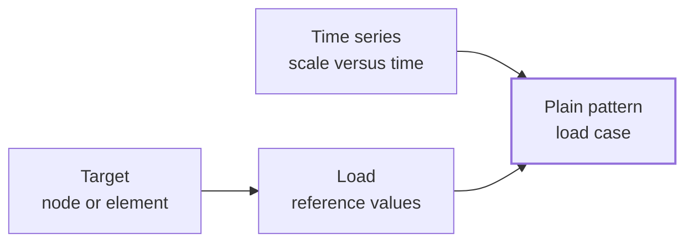

# Loading

Loading describes how forces, prescribed values, and support motions enter the assembled model. A complete loading definition answers three questions:

```text
What acts on the model, and where?
How does its amplitude change with time?
How is it organized as a load case or excitation rule?
```

Femora separates those responsibilities so the same spatial load can be paired with a different history, and the same history can drive a different loading pattern.

## The Three Pieces

| Piece | Question it answers | Femora object |
| --- | --- | --- |
| Target and values | What is applied, and where? | A nodal, element, or prescribed-value load |
| Time history | How does the scale change with model time? | A time series |
| Loading rule | How is the history connected to the model? | A pattern |

For an ordinary force pattern, the relationship is:



The pattern is the bridge. It combines spatial loading instructions with a time-dependent scale into one managed load case.

## Load: What And Where

A load stores reference values and a target in the assembled model. Femora currently represents three ordinary load forms:

* A **nodal load** applies force and moment components to selected nodes.
* An **element load** applies a distributed or point load to selected beam-column elements.
* An **SP load** prescribes a value at one degree of freedom and scales that value through a pattern.

These objects define the spatial action. They do not independently define a load case or its variation with time.

???+ note "A load vector follows the target node's DOFs"
    The positions in a nodal load vector correspond to the target node's degrees of freedom. A three-DOF solid node uses translational entries, while a six-DOF frame node may also receive moment entries. The API reference documents validation and mask expansion behavior.

???+ note "An SP load is different from an SP constraint"
    An SP constraint fixes selected nodal motion as part of the model's kinematics. An SP load prescribes a value inside a plain pattern, so that value is scaled by the pattern's time series. Use the constraint namespace for a fixed boundary and the loading namespace for a time-dependent prescribed value.

## Time Series: How The Scale Changes

A time series is a scalar function of model time. It does not select nodes or elements and does not contain the load vector. Instead, it supplies the factor used by a pattern as analysis time advances.

For a plain pattern, the conceptual relationship is:

```text
applied values at time t
    = reference load values
    x time-series value at t
    x pattern factor
```

A constant series keeps the scale fixed. A linear series follows model time and is commonly used to ramp a static reference load. A path series reads or stores sampled values and is commonly used for recorded histories. Femora also provides trigonometric, ramp, pulse, triangular, and rectangular series.

???+ warning "A time series does not choose the analysis time step"
    A time series defines a function or sampled history. The analysis and its integrator determine how solver time advances and therefore when that history is evaluated. Time-series data and analysis stepping must be consistent, but they are different decisions.

## Pattern: How Loading Reaches The Model

A pattern is not simply another name for a load. It defines a solver loading rule. There are two main families.

=== "Ordinary loads"

    A `PlainPattern` references one time series and contains explicit nodal, element, or SP loads. This is the normal path for gravity, static lateral forces, distributed beam loads, and other directly specified actions.

    ```text
    time series + explicit loads -> PlainPattern
    ```

=== "Support and boundary excitation"

    Specialized patterns describe excitation directly and therefore do not need ordinary loads attached through `add_load`:

    * `UniformExcitation` applies one acceleration history in a global DOF direction.
    * `MultipleSupportPattern` associates support nodes with managed ground motions.
    * `H5DRMPattern` maps an H5DRM dataset to the model boundary.

    ```text
    motion history or dataset -> specialized pattern
    ```

This distinction explains why every ordinary load needs a pattern, but not every pattern contains ordinary load objects.

## Continue The Soil-Structure Model

The model from [Constraints](constraints.md) is assembled and constrained. We will apply a reference lateral force at the free end of its beam. The example follows the same order as the mental model: select the target, define the history, create the pattern, and attach the load.

## Step 1: Select The Loaded Node

The beam ends at `(4.0, 0.0, 3.0)`. Use the assembled-model mask API to select the node near that coordinate:

```python
beam_tip = model.mask.nodes.near_point(
    point=(4.0, 0.0, 3.0),
    radius=1.0e-6,
)
```

The mask keeps geometric selection separate from the loading definition. If the final node tag changes after remeshing, the loading code still expresses the intended location.

## Step 2: Define The Loading History

Use a linear series so the reference force follows the static analysis time:

```python
loading_history = model.time_series.linear(factor=1.0)
```

The time series is now managed by this model and has its own tag, but it does not yet act on the mesh.

## Step 3: Create The Load Case

Create a plain pattern and connect it to the time series:

```python
lateral_loading = model.pattern.plain(
    time_series=loading_history,
    factor=1.0,
)
```

The pattern defines one coherent load case. Additional loads attached to this same pattern would share its history and pattern factor.

## Step 4: Attach The Nodal Load

Create the load through the pattern so Femora both manages it and attaches it to the correct load case:

```python
lateral_loading.add_load.node(
    node_mask=beam_tip,
    values=[100_000.0, 0.0, 0.0, 0.0, 0.0, 0.0],
)
```

The six entries correspond to the beam node's six degrees of freedom. This reference vector applies a positive X force and no force or moment in the other components.

???+ warning "Creating an unattached load is not enough"
    Ordinary loads are emitted inside a plain pattern. The recommended interface is `pattern.add_load.node(...)`, `pattern.add_load.element(...)`, or `pattern.add_load.sp(...)` because it creates and attaches the load in one operation.

## Read The Complete Definition

The four steps create one loading statement that can be read without inspecting solver tags:

```text
At the assembled beam-tip node,
apply a +100,000 X reference force,
scale it with a linear history,
and organize it as the lateral-loading pattern.
```

The mesh target, reference magnitude, and time dependence remain separate, but their relationships are explicit.

## Specialized Excitation Uses A Shorter Path

For uniform ground acceleration, the time series connects directly to a specialized pattern:

```python
acceleration = model.time_series.path(
    dt=0.01,
    filePath="motion.acc",
    factor=9.81,
)

earthquake = model.pattern.uniform_excitation(
    dof=1,
    time_series=acceleration,
)
```

There is no `add_load.node(...)` call because the pattern itself defines how the acceleration history excites the model. Multiple-support and H5DRM loading follow the same general idea but use ground-motion objects or an external boundary dataset.

???+ note "Static and dynamic are analysis decisions"
    A linear series is often used in static loading and a recorded path is often used in transient loading, but the time-series class alone does not make an analysis static or dynamic. The analysis configuration determines how equilibrium is solved and how model time advances.

???+ note "Process ordering comes later"
    A managed pattern defines the loading but does not determine its position in the solver workflow. The [Process](process.md) concept later explains how patterns, recorders, actions, and analyses are ordered as the final integration step.

## API Reference

The generated API reference contains the available load forms, time-series families, pattern types, exact signatures, validation rules, and manager lifecycle methods.

<div class="grid cards" markdown>

-   :material-weight: **[Load Manager](../reference/core/LoadManager/index.md)**

    Nodal, element, and prescribed-value load factories.

-   :material-chart-timeline-variant: **[Time Series Manager](../reference/core/TimeSeriesManager/index.md)**

    Constant, linear, path, and analytic time-history factories.

-   :material-sine-wave: **[Pattern Manager](../reference/core/PatternManager/index.md)**

    Plain, uniform-excitation, multiple-support, and H5DRM pattern factories.

-   :material-code-braces: **[Loading Components](../reference/components/load/index.md)**

    Concrete load classes and their target-specific parameters.

</div>

## Related Concepts

* [Constraints](constraints.md): Define allowable motion before loading the model.
* [Regions and Groups](regions-and-groups.md): Organize and select parts of the assembled model.
* [Damping](damping.md): Define energy dissipation independently from loading.
* [Recorders and Actions](recorders-and-actions.md): Observe response and define runtime state changes.
* [Analysis](analysis.md): Choose how the solver advances load or time.
* [Process](process.md): Place the pattern into the final ordered workflow.
