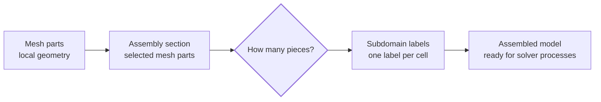

# Partitioning

Partitioning divides an assembly section into subdomains that can later be assigned to different solver processes. It prepares a large model for parallel solution without changing its physical geometry, materials, or element formulations.

## Why A Mesh Is Partitioned

Large models can be solved faster when their work is distributed across more than one processor. Partitioning defines that distribution before the solver starts.

Femora makes this choice per **assembly section** because element count alone does not predict runtime. A small section using demanding nonlinear materials, detailed interfaces, or expensive element formulations can cost more than a much larger elastic section. Conversely, a large soil domain may need several subdomains simply because it contains many cells.

An assembly section therefore defines a workload boundary: you choose which mesh parts should be handled together, then decide how many subdomains that workload needs.

## Mental Model



Assembly creates the section mesh first. Partitioning then labels every cell with its subdomain. When Femora combines sections into the assembled model, the labels identify the work assigned to each solver process later.

???+ note "Partitioning does not alter the mesh"
    Partitioning does not add, remove, merge, or move cells. If a mesh has 10,000 cells before partitioning, it still has 10,000 cells afterward. Only each cell's subdomain label changes.

## Choose The Scope First

Partitioning is configured when you create an assembly section. The first decision is therefore about workload, not algorithm: **which mesh parts should be handled together, and how much work should that section receive?**

For example, a frame and a soil block can be separate sections because they are different parts of the physical model. Each section can then have its own partitioning choice.

```python
frame_section = model.assembler.create_section(
    meshparts=["columns", "beams"],
    num_partitions=1,
)

soil_section = model.assembler.create_section(
    meshparts=["soil_layer_1", "soil_layer_2"],
    num_partitions=4,
    partitioner="metis",
)
```

The frame section stays whole. The soil section is divided into four subdomains. Both remain part of the same assembled model, but Femora can prepare them differently.

???+ tip "Start from physical meaning"
    Create sections around meaningful workloads, not only visible geometry. A small nonlinear subsystem may deserve more partitioning attention than a larger elastic one. Choose the number of partitions after deciding both the physical scope and its expected computational cost.

???+ note "What Femora can and cannot balance"
    The built-in partitioners balance cells and use either mesh connectivity or cell location. They do not estimate the cost of an individual material model, element formulation, or interface calculation. Use assembly-section boundaries to express known differences in computational cost.

## What `num_partitions` Means

`num_partitions` tells Femora how many subdomains an assembly section contributes. The values `0`, `1`, and values greater than `1` are deliberately different.

| Value | Meaning for the section | Result inside that section |
| --- | --- | --- |
| `0` | Keep the section serial. It contributes no partition allocation. | The section remains serial. |
| `1` | Keep all cells together as one section partition. | The section occupies one subdomain. |
| `2` or more | Divide the section into the requested number of pieces. | The selected partitioner assigns cells to subdomains. |

The difference between `0` and `1` matters in a model with multiple sections. `0` keeps a section outside partition allocation; `1` reserves one complete partition for that section. A larger number divides only that section, not every mesh part in the model.

=== "Keep a section serial"

    ```python
    model.assembler.create_section(
        meshparts=["small_frame"],
        num_partitions=0,
    )
    ```

    Use this when the section should remain serial even if other sections are divided.

=== "Keep a section together"

    ```python
    model.assembler.create_section(
        meshparts=["foundation", "superstructure"],
        num_partitions=1,
    )
    ```

    Use this when several mesh parts belong to one undivided section.

=== "Divide one section"

    ```python
    model.assembler.create_section(
        meshparts=["soil_layer_1", "soil_layer_2"],
        num_partitions=4,
        partitioner="metis",
    )
    ```

    Use this when the selected section should be split into several labeled pieces.

## How A Partitioner Draws The Boundaries

Once a section needs more than one subdomain, Femora needs a rule for deciding which cells belong together. That rule is the partitioner.

Every partitioner sees the same mesh. What changes is the information it prioritizes. Some methods use cell connectivity; others use cell-center positions. The result is a different set of subdomain boundaries.

| Partitioner | Main idea | Useful when |
| --- | --- | --- |
| `metis` | Uses the cell-connectivity graph and minimizes cut edges. | The mesh is irregular and you want partitions that strongly favor connected neighborhoods. |
| `kd-tree` | Repeatedly cuts cell-center space along coordinate directions. | You want simple axis-aligned spatial cuts and a power-of-two count is acceptable. |
| `geometric` | Splits from the spatial spread of cell centers. | You want a geometry-only recursive division. |
| `morton` | Orders cell centers along a Z-order space-filling path, then cuts that order. | You want a lightweight locality-aware ordering. |
| `hilbert` | Orders cell centers along a Hilbert space-filling path, then cuts that order. | You want a locality-preserving spatial ordering. |

`metis` is usually the strongest starting point for an irregular, connected finite-element domain because it reasons about cell adjacency. The other methods use positions of cell centers, so they are fast spatial rules rather than mesh-topology rules.

???+ warning "Connected-looking is not a guarantee"
    Femora currently does not enforce connectivity after partitioning. METIS most strongly favors connected regions because it uses the cell graph, but even METIS is not a strict guarantee. KD-tree, geometric, Morton, and Hilbert use cell-center positions or spatial ordering, so a concave domain, hole, disconnected mesh, or narrow bridge can leave one label in separate unconnected regions. Inspect the partition plot when connected subdomains matter.

???+ note "A KD-tree has a special count rule"
    KD-tree division repeatedly splits a region in two. If you request a count that is not a power of two, Femora rounds it up to the next power of two. For example, a request for `6` creates `8` KD-tree partitions. The other partitioners use the requested count directly, so choose `metis`, `geometric`, `morton`, or `hilbert` when an exact non-power-of-two count is required.

## Compare One Mesh With Five Rules

The five views below use the same irregular triangular mesh, including a concave boundary and an internal void. Every view requests four partitions. The mesh itself is identical, so the colored regions show only how each rule draws subdomain boundaries.

=== "METIS"

    <iframe src="../../assets/partitioning/irregular_2d_metis.html" style="width: 100%; height: 560px; border: 1px solid var(--md-default-fg-color--lightest); border-radius: 8px;" title="METIS partitioning of an irregular mesh"></iframe>

    METIS follows the cell-connectivity graph. Its regions tend to form connected neighborhoods despite the interior void and irregular outer boundary, although it does not enforce that as an absolute rule.

=== "KD-tree"

    <iframe src="../../assets/partitioning/irregular_2d_kd-tree.html" style="width: 100%; height: 560px; border: 1px solid var(--md-default-fg-color--lightest); border-radius: 8px;" title="KD-tree partitioning of an irregular mesh"></iframe>

    KD-tree repeatedly makes spatial cuts. Its boundaries reflect coordinate directions more directly than mesh connectivity and its partition count must be a power of two.

=== "Geometric"

    <iframe src="../../assets/partitioning/irregular_2d_geometric.html" style="width: 100%; height: 560px; border: 1px solid var(--md-default-fg-color--lightest); border-radius: 8px;" title="Geometric partitioning of an irregular mesh"></iframe>

    Geometric partitioning uses the spread of cell centers to decide where to split the section.

=== "Morton"

    <iframe src="../../assets/partitioning/irregular_2d_morton.html" style="width: 100%; height: 560px; border: 1px solid var(--md-default-fg-color--lightest); border-radius: 8px;" title="Morton partitioning of an irregular mesh"></iframe>

    Morton follows a Z-order spatial path, then divides that path into ranges. Nearby cells often remain near one another in the resulting labels.

=== "Hilbert"

    <iframe src="../../assets/partitioning/irregular_2d_hilbert.html" style="width: 100%; height: 560px; border: 1px solid var(--md-default-fg-color--lightest); border-radius: 8px;" title="Hilbert partitioning of an irregular mesh"></iframe>

    Hilbert uses a related space-filling path designed to preserve spatial locality along the ordering.

???+ tip "Read the colors as subdomains"
    The colors identify subdomains only. They do not indicate different materials, element types, or regions, and a different color map does not change the partitioning result.

## Inspect The Result

After assembly, Femora stores the subdomain label in the `Core` cell-data array on the assembled PyVista mesh. Plotting `Core` is the clearest way to verify that the section was divided as intended.

```python
model.assembler.assemble()

mesh = model.assembled_mesh
print(mesh.cell_data["Core"])
model.assembler.plot(scalars="Core", show_edges=True)
```

Use this check after changing a section's mesh parts, partition count, or partitioner. The [Assembled Model](assembled-model.md) page explains the other point and cell data retained on this mesh.

## Related Concepts

* [Assembly](assembly.md): Create the sections that partitioning organizes.
* [The Assembled Model](assembled-model.md): Inspect `Core` and other assembled-mesh metadata.
