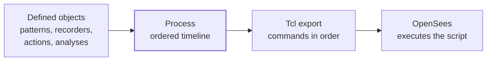

# Process

The model is assembled, its behavior is assigned, and the objects needed for the simulation have been defined. The remaining question is no longer **what exists**, but **what happens, and in what order**.

Femora answers that question with `model.process`. A process is an ordered executable timeline of previously defined components. It is not an analysis algorithm, a solver, or a command that runs OpenSees by itself.

```text
Definition: What does this object represent?
Process:    When should its command appear?
Analysis:   How should the solver advance the model?
Export:     How is the complete model translated for OpenSees?
```

## The Final Integration Step

Earlier concept pages treated [loading](loading.md), [recorders and actions](recorders-and-actions.md), [constraints](constraints.md), and [analysis](analysis.md) separately because each has its own responsibility. Process brings the runtime components together without changing those responsibilities.



The distinction between export and execution matters. `model.export_to_tcl(...)` writes the model and the ordered process to a Tcl script. The analyses run only when OpenSees executes that script.

???+ note "Process is not the solver"
    `model.process.add_step(...)` does not solve an equation and does not advance time. It records where a component's Tcl representation belongs in the exported command sequence. An `Analysis` component is the step that configures the numerical solution and issues the OpenSees `analyze` commands.

## What Can Appear In A Process

The current process manager accepts the following component types:

| Component | Effect when its step is reached |
| --- | --- |
| `Pattern` | Introduces a load pattern or excitation rule into the active domain |
| `Recorder` | Creates a runtime recorder that observes subsequent converged response |
| `Action` | Emits a state-changing command at that exact location |
| `Analysis` | Configures the analysis, advances the model, and then clears that analysis configuration |
| `SPConstraint` | Emits a single-point constraint command |
| `MPConstraint` | Emits a multi-point constraint command |

Patterns, recorders, analyses, and constraints are normally created and managed by their corresponding model managers. Actions are lightweight commands created through `model.actions` for transitions such as holding the current load state, changing time, removing recorders, or changing material stage.

???+ warning "Ordinary constraints already belong to model export"
    Although `ProcessManager` accepts SP and MP constraint objects, Femora's Tcl exporter already writes all model-managed constraints during model setup, before time series and the process block. Adding the same managed constraint to the process can therefore emit it again. Use `model.constraint` for ordinary assembled-model constraints; schedule a constraint only for a deliberate staged workflow whose solver behavior you have verified.

## Defining Is Not Scheduling

Creating an object through a manager gives Femora its definition. It does not automatically place that object in the runtime timeline.

```python
# These objects are defined and managed, but this code does not order them.
gravity_pattern = model.pattern.plain(time_series=gravity_series)
tip_displacement = model.recorder.node(
    file_name="beam_tip_disp.out",
    nodes=beam_tip_tags,
    dofs=[1],
    resp_type="disp",
    time=True,
)
gravity_analysis = model.analysis.static(
    name="gravity",
    constraint_handler=gravity_constraints,
    numberer=gravity_numberer,
    system=gravity_system,
    algorithm=gravity_algorithm,
    test=gravity_test,
    integrator=gravity_integrator,
    num_steps=10,
)
```

The complete signatures and choices belong in the API reference and in their dedicated concept pages. At the process level, these objects are already prepared inputs. Scheduling them is a separate operation:

```python
model.process.add_step(
    gravity_pattern,
    description="Introduce gravity loading",
)
model.process.add_step(
    tip_displacement,
    description="Start recording beam-tip displacement",
)
model.process.add_step(
    gravity_analysis,
    description="Run gravity analysis",
)
```

This order means: introduce the gravity pattern, activate the recorder, and then advance the model. Reversing those lines changes the simulation rather than merely changing its presentation.

???+ tip "Write descriptions as runtime events"
    A description becomes a comment heading in the exported Tcl. Prefer `"Start recording beam-tip displacement"` or `"Run gravity analysis"` over vague labels such as `"Step 3"`. Clear descriptions make a generated script much easier to inspect and debug.

## Build A Multi-Stage Timeline

Continue the soil-structure example from the earlier concepts. Assume the following managed objects have already been defined:

| Existing object | Responsibility |
| --- | --- |
| `gravity_pattern` | Introduces the gravity loads |
| `gravity_analysis` | Advances the model through the gravity stage |
| `seismic_pattern` | Introduces the support excitation |
| `dynamic_analysis` | Advances the model through the transient stage |
| `tip_displacement` | Records the selected response after activation |

We need two transitions between the analyses. First, retain the converged gravity load level. Then reset pseudo-time before the earthquake history begins:

```python
hold_gravity = model.actions.load_const()
reset_time = model.actions.set_time(0.0)
stop_recording = model.actions.remove_recorders()
```

Creating these actions still does nothing to the solver. Their position gives them meaning.

### Step 1: Introduce Gravity And Observe It

```python
model.process.add_step(
    gravity_pattern,
    description="Introduce gravity loading",
)
model.process.add_step(
    tip_displacement,
    description="Start recording beam-tip displacement",
)
model.process.add_step(
    gravity_analysis,
    description="Run gravity analysis",
)
```

The recorder is placed before `gravity_analysis`, so its output includes the gravity stage. If only the dynamic response were required, the recorder could instead be placed after the gravity transitions and before `dynamic_analysis`.

### Step 2: Close The Gravity Stage

```python
model.process.add_step(
    hold_gravity,
    description="Hold the converged gravity load",
)
model.process.add_step(
    reset_time,
    description="Reset pseudo-time before excitation",
)
```

These are two independent state changes. `load_const()` emits the command that holds the current loading state. `set_time(0.0)` explicitly sets the time seen by later commands.

???+ note "An Analysis cleans up its own analysis configuration"
    The current `Analysis.to_tcl()` output ends with `wipeAnalysis`. This clears the numerical analysis configuration after that analysis finishes while preserving the finite-element domain. A separate `model.actions.wipe_analysis()` step is therefore not normally required between managed `Analysis` components.

### Step 3: Run The Dynamic Stage

```python
model.process.add_step(
    seismic_pattern,
    description="Introduce earthquake excitation",
)
model.process.add_step(
    dynamic_analysis,
    description="Run transient analysis",
)
model.process.add_step(
    stop_recording,
    description="Close runtime recorders",
)
```

The excitation must exist before the transient analysis advances time. The recorder remains active through both analyses and is removed only after the dynamic stage has finished.

The complete process now reads as an engineering sequence rather than a collection of disconnected commands:

```mermaid
flowchart LR
    gravity["Gravity pattern"] --> recorder["Start recorder"]
    recorder --> static["Gravity analysis"]
    static --> hold["Hold gravity"]
    hold --> time["Reset time"]
    time --> motion["Seismic pattern"]
    motion --> transient["Transient analysis"]
    transient --> close["Remove recorders"]

    classDef definition stroke-width:1px;
    classDef advance stroke-width:2px;
    classDef transition stroke-width:1px,stroke-dasharray:4 2;
    class gravity,recorder,motion definition;
    class static,transient advance;
    class hold,time,close transition;
```



## Ordering Changes Behavior

Process order is executable state, not documentation order. Three rules prevent most workflow errors:

| Requirement | Correct placement | Consequence of incorrect placement |
| --- | --- | --- |
| Apply loading | Pattern before the analysis that should use it | The analysis advances without that loading rule |
| Capture response | Recorder before the analysis to observe | Earlier response cannot be recovered afterward |
| Change stages | Action between the stages it separates | The action changes the wrong stage, or has no useful effect |

???+ warning "A valid component can still be in the wrong place"
    Type validation only confirms that an object is allowed in the process. It cannot determine your engineering intent. A recorder placed after an analysis, a pattern introduced too late, or `remove_recorders()` placed too early is syntactically valid but behaviorally wrong.

???+ warning "Terminal actions end the remaining timeline"
    `model.actions.exit()` terminates OpenSees, and `model.actions.wipe()` clears the complete domain. Any steps placed after either action may be unreachable or invalid. Use them only when that termination or reset is intentional.

## Inspect And Edit The Timeline

`ProcessManager` preserves list order. You can inspect the completed timeline before export without changing it:

```python
for step_index, step in enumerate(model.process.get_steps()):
    print(step_index, step["description"])
```

During construction, `add_step(...)` returns the zero-based index of the appended entry. `insert_step(index, ...)` places a component at a chosen position. Both methods also accept a list of supported components, with each component becoming its own entry. `get_step(index)` retrieves one entry, `remove_step(index)` removes one entry, and `clear()` removes the complete timeline. Use these operations before export; changing the Python process does not alter a Tcl file that has already been written.

???+ note "The process refers to managed objects"
    Internally, the process keeps non-owning references to managed patterns, recorders, constraints, and analyses; actions are retained directly. In normal use this is transparent because the model managers own their components. Do not remove or clear a managed component after scheduling it and then expect the process entry to remain valid.

## What Tcl Export Does

When `model.export_to_tcl(...)` runs, Femora does not start at the process. It first writes the solver model: materials, transformations, sections, nodes, elements, damping, regions, constraints, and time series. Only after those prerequisites exist does it ask `ProcessManager` to emit the timeline.

```text
model definition
    -> damping and regions
    -> model constraints
    -> time series
    -> process steps in list order
    -> exit
```

For each process entry, Femora writes a heading from its description and then calls that component's `to_tcl()` method. Conceptually, the example becomes:

```tcl
# Introduce gravity loading ======================================
pattern Plain ...

# Start recording beam-tip displacement =========================
recorder Node ...

# Run gravity analysis ===========================================
constraints ...
numberer ...
system ...
algorithm ...
test ...
integrator ...
analysis Static
analyze 10
wipeAnalysis

# Hold the converged gravity load ================================
loadConst
```

The exact commands depend on the scheduled objects. The important guarantee is that the process entries are translated in their stored order.

```python
model.export_to_tcl("model.tcl")
```

This creates the OpenSees script. Running that script is a separate execution operation.

???+ tip "Debug the process from both sides"
    Before export, inspect `model.process.get_steps()` to confirm the Python order and descriptions. After export, inspect the `# Process` section of the Tcl file to confirm the commands produced by each component. This separates timeline mistakes from component-translation mistakes.

## API Reference

The generated API reference provides exact signatures, accepted arguments, return values, and component-specific behavior.

<div class="grid cards" markdown>

-   :material-format-list-numbered: **[Process Manager](../reference/core/ProcessManager/index.md)**

    Ordered-step creation, insertion, removal, inspection, and Tcl rendering.

-   :material-playlist-edit: **[Action Manager](../reference/core/ActionManager/index.md)**

    Factories for runtime transitions that can be placed in a process.

-   :material-calculator-variant-outline: **[Analysis Manager](../reference/core/AnalysisManager/index.md)**

    Static, transient, and variable-transient analysis definitions.

-   :material-code-braces: **[Process Component Sources](../reference/components/index.md)**

    Pattern, recorder, action, constraint, and analysis component implementations.

</div>

## The Concepts Path Is Complete

You can now read a Femora model as one continuous workflow:

```text
organize definitions
    -> create mesh parts and interfaces
    -> assemble and partition the domain
    -> inspect tags, regions, and groups
    -> define constraints and physical behavior
    -> define loading, recording, actions, and analyses
    -> order the executable process
    -> export and run
```

The Concepts section explains how these pieces fit together. Continue with the [Tutorial Gallery](../tutorials/index.md) to build complete models, browse the [Example Gallery](../examples/index.md) for focused modeling patterns, and use the [API Reference](../reference/index.md) when you need exact signatures and implementation-level detail.
