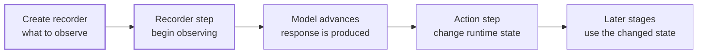

# Recorders and Actions

Once loading has been defined, a solver workflow needs two additional kinds of instructions. It needs **recorders** to observe the response, and it may need **actions** to change the runtime state between stages.

```text
Recorder: Observe the solver state and write selected response data.
Action:   Change the solver state at a specific point in the workflow.
```

Both can appear in Femora's ordered process, but they have opposite roles. A recorder is passive: it watches what happens after it becomes active. An action is active: it changes what subsequent steps will see.

## Two Roles In One Timeline



The order matters. A recorder cannot recover response from steps that occurred before it became active. Likewise, an action affects only the commands that execute after it.

This page explains the objects placed on that timeline. [Process](process.md) later explains how the complete timeline is assembled, and [Analysis](analysis.md) explains how the model is advanced.

## Recorders Observe Response

A runtime recorder answers four practical questions:

| Question | Typical recorder input |
| --- | --- |
| What should be observed? | Displacement, acceleration, drift, force, stress, or another response type |
| Where should it be observed? | Node tags, a node range, a region, an element group, a mesh part, or an interface, depending on recorder type |
| When should samples be written? | Every converged step or an optional recording interval such as `delta_t` |
| Where should data go? | A text, XML, binary, VTKHDF, MPCO, or network destination supported by that recorder |

Creating a recorder through `model.recorder` registers its definition with the model. It does not start observing immediately. The corresponding recorder command becomes active only when the ordered process reaches the recorder step.

???+ note "Recorder capabilities are type-specific"
    There is no universal target argument shared by every recorder. A node recorder accepts node tags, a node range, or one region. A drift recorder accepts paired node tags. VTKHDF and MPCO recorders can restrict element output through supported regions or element groups, while the beam-force recorder resolves selected line mesh parts. Use the API reference for the exact target and response options of the recorder you choose.

## Continue The Soil-Structure Model

The model from [Loading](loading.md) already contains `beam_tip`, a node mask selecting the free end of the beam. Convert that assembled-mesh selection to solver node tags, then create a displacement recorder:

```python
beam_tip_tags = beam_tip.to_tags()

tip_displacement = model.recorder.node(
    file_name="beam_tip_disp.out",
    nodes=beam_tip_tags,
    dofs=[1],
    resp_type="disp",
    time=True,
    delta_t=0.01,
)
```

Read this definition as one observation request:

```text
At the assembled beam-tip node,
record displacement in DOF 1,
include model time,
and write samples no closer than 0.01 time units apart.
```

The mask performs geometric selection; `to_tags()` converts the selected point indices to the node tags expected by the runtime recorder. This keeps the geometric intent visible without making the recorder responsible for spatial searches.

???+ warning "Recorder `delta_t` is not the analysis time step"
    `delta_t` controls when the recorder writes samples. It does not control how the solver advances time or how often equilibrium is solved. Those decisions belong to the analysis configuration.

## Choose The Smallest Useful Scope

Recorder scope has a direct effect on output size and runtime I/O. A few response histories are usually inexpensive; writing many fields for an entire large model at every converged step can dominate the run.

Femora provides several verified targeting paths:

| Recorder | Supported targeting concept |
| --- | --- |
| `model.recorder.node(...)` | Explicit node tags, a contiguous node range, or a region tag |
| `model.recorder.drift(...)` | Paired lower and upper node tags |
| `model.recorder.vtkhdf(...)` | Whole model, one region, or one element group |
| `model.recorder.mpco(...)` | Whole model or lists of regions and element groups |
| `model.recorder.beam_force(...)` | Selected line mesh parts, or all line mesh parts when omitted |
| `model.recorder.embedded_beam_solid_interface(...)` | Selected embedded beam-solid interfaces |

Regions are useful when output follows a model domain already defined by a component. Element groups are useful for an assembled-mesh selection that may cross region boundaries. Direct node tags are appropriate when a mask or another post-assembly operation has already identified the exact nodes.

???+ tip "Select first, record second"
    Keep selection logic outside the recorder when the recorder does not natively accept that selection type. For example, create a node mask from coordinates or metadata, convert it with `to_tags()`, and pass the resulting list to `nodes=`. This makes the selection independently inspectable and reusable.

## Actions Alter Runtime State

An action is a command that changes the OpenSees runtime when the process reaches it. Actions do not observe response and do not produce a response history. They create transitions between stages.

Common action roles include:

| Transition | Femora factory | Effect on later steps |
| --- | --- | --- |
| Hold the current loading state | `model.actions.load_const()` | Makes active loading constant before the next stage |
| Change model time | `model.actions.set_time(...)` | Sets the pseudo-time used by subsequent commands |
| Stop runtime recording | `model.actions.remove_recorders()` | Flushes, closes, and removes active solver recorders |
| Remove managed load patterns | `model.actions.remove_load_patterns()` | Removes the model's pattern tags from the active domain |
| Replace analysis configuration | `model.actions.wipe_analysis()` | Clears analysis objects while preserving the finite-element domain |
| Change material behavior | Material parameter and stage actions | Updates supported material state for later analysis stages |
| Insert an unsupported command | `model.actions.tcl(...)` | Emits custom Tcl at that exact process location |

Actions are lightweight factory results. Creating one does not execute it:

```python
hold_gravity = model.actions.load_const()
stop_recording = model.actions.remove_recorders()
reset_runtime_time = model.actions.set_time(0.0)
```

Their meaning comes from where they are placed later.

???+ warning "Use destructive actions deliberately"
    `wipe_analysis()` clears only the active analysis configuration. `wipe()` clears the entire OpenSees domain, including nodes, elements, materials, loading, and analysis objects. `exit()` terminates the solver. These are valid workflow tools, but their placement can make every following step impossible to execute.

???+ tip "Treat raw Tcl as an escape hatch"
    `model.actions.tcl(...)` provides access to OpenSees behavior that Femora does not yet model directly. Prefer a typed Femora action when one exists because typed actions can validate model references and communicate intent more clearly.

## Creation And Placement Are Separate

Recorder and action creation describes **what** each object does. Process placement describes **when** it takes effect.

The following is an ordering preview, not a complete process tutorial:

```python
model.process.add_step(
    tip_displacement,
    description="Start recording beam-tip displacement",
)

# One or more analysis steps that advance the model are placed here.

model.process.add_step(
    stop_recording,
    description="Stop response recording",
)
```

The intended timeline is:

```text
create recorder in Python
        |
        v
emit recorder command  ->  advance the model  ->  remove active recorders
        |                       |
        +------ samples --------+
```

Moving the recorder below the advancing analysis would omit that analysis response. Moving `remove_recorders` above it would activate and immediately remove the recorder, leaving no useful history.

The same reasoning applies to other actions. `load_const()` belongs after the loading stage whose current load level must be retained, and `wipe_analysis()` belongs after the old analysis configuration is no longer needed but before a replacement is introduced.

## Two Different Kinds Of Removal

Femora has a Python definition lifecycle and an OpenSees runtime lifecycle. They should not be confused:

=== "Remove before export"

    ```python
    model.recorder.remove(tip_displacement.tag)
    ```

    This removes the recorder definition from `model.recorder` and compacts the remaining recorder tags. Use it while editing the Python model before the process is exported. If the recorder was already placed in `model.process`, remove that process step separately; manager removal does not rewrite the process timeline.

=== "Remove during the run"

    ```python
    stop_recording = model.actions.remove_recorders()
    ```

    When placed in the process, this emits `remove recorders`. It stops all recorder objects currently active in OpenSees and closes their output files. It does not edit the Python recorder manager.

???+ note "A removed runtime recorder does not restart itself"
    Once `remove recorders` executes, an earlier recorder command is no longer active. A later stage needs another recorder command if observation must resume.

## Runtime Results Are Not Model Exports

Runtime recorder files and Femora model exports serve different purposes:

| Output | Created when | What it represents |
| --- | --- | --- |
| Node, drift, force, VTKHDF, or MPCO recorder output | During OpenSees execution, after its recorder command becomes active | Response evolving through solver time or analysis steps |
| `model.export_to_vtk(...)` | During Python-side model export | The assembled mesh and its model metadata for inspection or visualization |
| `model.export_to_json(...)` | During Python-side model export | A lightweight structural and provenance snapshot |
| `model.export_to_tcl(...)` | Before solver execution | The OpenSees model and ordered command script |

A VTK mesh export can show topology, partitions, regions, and provenance before a run, but it is not a displacement history. Conversely, the VTKHDF **recorder** is a runtime command that writes selected evolving response fields. Similar file technology does not make these two operations equivalent.

## Parallel Output Needs An Ownership Plan

In a partitioned model, more than one OpenSees process may execute recorder commands. Femora's recorder implementations use different strategies according to their output format: some can be restricted with `cores=`, some add the process ID to output names, and specialized beam-force output is generated per mesh part and core.

The practical rule is to decide which process owns each output file. Do not assume that every generic recorder automatically creates collision-free filenames for every parallel configuration. Verify the recorder's `cores`, target, and filename behavior in its API reference, especially when several processes could write the same path.

???+ warning "Output can become the bottleneck"
    Partitioning accelerates computation only if output remains manageable. Whole-model response fields at short intervals can create many large per-process files and overwhelm storage bandwidth. Start with the response quantities and spatial scope needed for the engineering question, then expand only when justified.

## API Reference

The generated API reference is the source for exact recorder response names, target combinations, output formats, action parameters, validation rules, and process signatures.

<div class="grid cards" markdown>

-   :material-record-rec: **[Recorder Manager](../reference/core/RecorderManager/index.md)**

    Recorder factories, manager lifecycle methods, and specialized pile helpers.

-   :material-playlist-edit: **[Action Manager](../reference/core/ActionManager/index.md)**

    Runtime-state action factories and their parameters.

-   :material-database-arrow-right-outline: **[Recorder Components](../reference/components/recorder/index.md)**

    Node, drift, VTKHDF, MPCO, beam-force, and interface recorder details.

-   :material-state-machine: **[Action Components](../reference/components/actions/index.md)**

    Exact runtime effects and emitted Tcl commands for each action type.

-   :material-format-list-numbered: **[Process Manager](../reference/core/ProcessManager/index.md)**

    Exact methods for placing and editing ordered process steps.

</div>

## Related Concepts

* [Loading](loading.md): Define the patterns whose effects recorders observe and actions may preserve or remove.
* [Regions and Groups](regions-and-groups.md): Build reusable domains and assembled-mesh selections for supported recorder types.
* [Partitioning](partitioning-and-parallel-execution.md): Understand the `Core` ownership used by partition-aware output.
* [Analysis](analysis.md): Define the solver advancement that produces recorded response.
* [Process](process.md): Place recorders, actions, patterns, and analyses into the complete ordered workflow.
