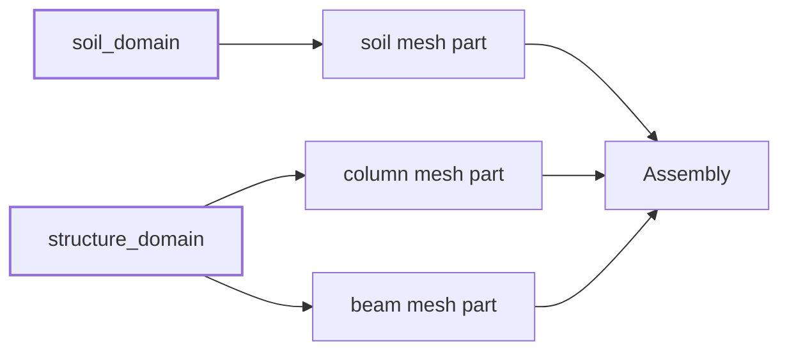
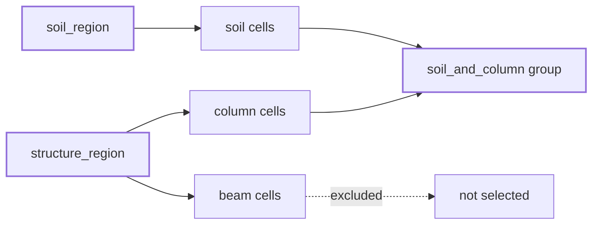

# Regions and Groups

Regions and groups both organize cells, but they belong to different sides of a Femora model:

```text
Region: What model domain does this mesh part belong to?
Group:  Which assembled cells or points do I want to work with?
```

A region is part of the model definition. It is assigned while a mesh part or reusable component is being created, and it travels with that component through assembly. A group is a selection made from the completed mesh. It never changes the component or its region.

This separation lets component developers publish meaningful model domains while users create as many additional selections as they need.

## Follow One Model As It Grows

The example below starts with three mesh parts:

* A soil block belongs to the soil domain.
* A column and beam belong to the structure domain.

The material and element definitions are assumed to have been created already, following the [Building Blocks](building-blocks.md) page.

## Step 1: Define The Model Domains

Create the regions before creating the mesh parts that will use them:

```python
soil_region = model.region.element(user_name="soil_domain")
structure_region = model.region.element(user_name="structure_domain")
```

At this point the regions do not contain final solver element IDs. They express ownership: the soil region will identify soil cells, and the structure region will identify structural cells.

## Step 2: Give Each Mesh Part Its Region

Pass the appropriate region when each mesh part is created:

```python
soil = model.meshpart.volume.uniform_rectangular_grid(
    user_name="soil",
    element=soil_brick,
    region=soil_region,
    x_min=-2.0,
    x_max=2.0,
    y_min=-2.0,
    y_max=2.0,
    z_min=-2.0,
    z_max=0.0,
    nx=4,
    ny=4,
    nz=2,
)

column = model.meshpart.line.single_line(
    user_name="column",
    element=column_element,
    region=structure_region,
    x0=0.0,
    y0=0.0,
    z0=0.0,
    x1=0.0,
    y1=0.0,
    z1=3.0,
    number_of_lines=3,
)

beam = model.meshpart.line.single_line(
    user_name="beam",
    element=beam_element,
    region=structure_region,
    x0=0.0,
    y0=0.0,
    z0=3.0,
    x1=4.0,
    y1=0.0,
    z1=3.0,
    number_of_lines=4,
)
```

The column and beam share one region even though they are independent mesh parts. The region states that both belong to the same structural domain.



???+ note "Mesh parts without an explicit region"
    Femora assigns `model.region.global_region`, with reserved tag `0`, to a mesh part that receives no region. This is the default internal domain. Create an explicit element region when the component needs a named model domain that can be addressed later.

## Step 3: Assemble The Mesh

Use the assembly workflow introduced on the previous pages:

```python
model.assembler.create_section(
    meshparts=["soil"],
    num_partitions=0,
)

model.assembler.create_section(
    meshparts=["column", "beam"],
    num_partitions=0,
    merge_points=True,
)

model.assembler.assemble()
mesh = model.assembled_mesh
```

During assembly, every contributed cell receives one value in the `Region` cell-data array. That value comes from the cell's mesh part:

```python
import numpy as np

soil_cell_count = np.count_nonzero(
    mesh.cell_data["Region"] == soil_region.tag
)
structure_cell_count = np.count_nonzero(
    mesh.cell_data["Region"] == structure_region.tag
)

print(f"Soil-region cells:      {soil_cell_count}")
print(f"Structure-region cells: {structure_cell_count}")
```

For this discretization, the result is:

```text
Soil-region cells:      32
Structure-region cells: 7
```

The important result is not only the count. Every cell entered assembly with one primary domain, and Femora preserved that domain in the completed mesh.

## Step 4: Select Soil And Column Cells With A Group

Suppose you need one selection containing the soil and column, but not the beam. A group can combine those two mesh parts even though they belong to different regions:

```python
soil_and_column = model.group.element.from_meshparts(
    name="soil_and_column",
    meshparts=["soil", "column"],
)

print(soil_and_column.cell_indices.size)  # 35
```

The group contains 32 soil cells and 3 column cells. The 4 beam cells are not selected. This group does not create cells or assign a new model domain; it only stores the indices of existing assembled cells.

The relationship is now:



The regions still say what the cells belong to. The group creates a new selection across those domains without changing either region.

## Step 5: Create An Overlapping Group

Now create another group containing the column and beam:

```python
frame_members = model.group.element.from_meshparts(
    name="frame_members",
    meshparts=["column", "beam"],
    line_cells_only=True,
)
```

The column cells now belong to both groups. The soil cells appear only in `soil_and_column`, while the beam cells appear only in `frame_members`:

```python
shared_indices = np.intersect1d(
    soil_and_column.cell_indices,
    frame_members.cell_indices,
)

print(f"Cells in both groups: {shared_indices.size}")  # 3
```

One cell can have only one primary `Region` value, but it can appear in any number of groups.

## Related Concepts

* [Tags and IDs](tags-and-ids.md): How region tags, mesh indices, and solver IDs differ.
* [The Assembled Model](assembled-model.md): The final cells, points, and metadata used by groups.
* [Damping](damping.md): Assign energy dissipation through the physical regions introduced here.
* [Constraints](constraints.md): Restrain motion and relate nodes in the assembled model.
* [Mesh Data Schema](../technical-reference/mesh-data-schema.md): The exact `Region` and mesh-part metadata arrays.
