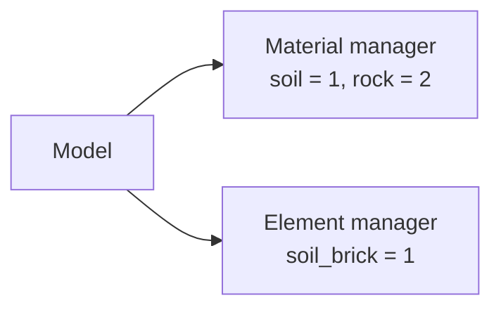

# Tags and IDs

You have already created materials, elements, mesh parts, and an assembled mesh without choosing integer identifiers. Femora assigned them through the managers owned by your `Model()`.

A **tag** is the integer a manager uses to identify one object. A material tag tells the material manager which material you mean; an element tag tells the element manager which element definition you mean. Tags make those references unambiguous when Femora writes the OpenSees model.

## Step 1: Let The Managers Assign Tags

Consider two materials and one brick element definition:

```python
from femora import Model

model = Model()

soil = model.material.nd.elastic_isotropic(
    user_name="soil",
    E=5.0e4,
    nu=0.30,
    rho=1.8,
)

rock = model.material.nd.elastic_isotropic(
    user_name="rock",
    E=2.0e6,
    nu=0.25,
    rho=2.4,
)

soil_brick = model.element.brick.std(
    ndof=3,
    material=soil,
)

print(f"soil material tag: {soil.tag}")
print(f"rock material tag:  {rock.tag}")
print(f"brick element tag:  {soil_brick.tag}")
```

The first objects in the two managers can both receive tag `1`:

```text
soil material tag: 1
rock material tag:  2
brick element tag:  1
```

This is valid because material tags and element-definition tags belong to different namespaces.



## Step 2: Use Names And Object References

Tags are essential internally, but normal Femora code should usually pass the object itself or use its readable name. In the previous example, `material=soil` is clearer and safer than manually supplying material tag `1`.

Managers support lookup when you need to recover an object:

```python
same_soil = model.material.get_by_name("soil")
same_rock = model.material.get(rock.tag)

print(same_soil is soil)  # True
print(same_rock is rock)  # True
```

Names are useful in model-building code, configuration files, and debugging output. Tags are useful when inspecting manager state, assembled mesh data, or generated Tcl.

## Step 3: Understand Tag Namespaces

Each manager owns an independent tag sequence. The same integer can therefore identify different objects when it appears in different OpenSees command families.

| Object | Owning namespace | Example meaning of tag `1` |
| --- | --- | --- |
| Material | `model.material` | First material definition |
| Element definition | `model.element` | First element template |
| Section | `model.section` | First section definition |
| Transformation | `model.transformation` | First geometric transformation |
| Mesh part | `model.meshpart` | First model-owned mesh part |
| Region | `model.region` | First non-global region |
| Assembly section | `model.assembler` | First assembly section |

The namespace gives the number its meaning. A tag by itself is incomplete information; “material tag 1” is meaningful, while “tag 1” may not be.

???+ example "Application: tracing an exported element"
    Suppose an assembled cell has `ElementTag = 1`. That value tells Femora to use element definition `1` when exporting the cell. The element definition then refers to its material object, whose tag belongs to the material namespace. This chain lets Femora write the correct element and material commands without requiring you to coordinate their numbers.

## Step 4: Know When Tags Can Change

Manager tags are compact. Removing an object causes the remaining objects in that manager to be retagged without gaps.

???+ warning "Retagging after removal"
    Consider three materials with tags `1`, `2`, and `3`. If material `2` is removed, the previous material `3` becomes material `2`.

    ```python
    temporary = model.material.nd.elastic_isotropic(
        user_name="temporary",
        E=1.0e4,
        nu=0.30,
    )
    replacement = model.material.nd.elastic_isotropic(
        user_name="replacement",
        E=8.0e4,
        nu=0.30,
    )

    old_tag = replacement.tag
    model.material.remove(temporary.tag)

    print(old_tag)         # 4 in this running example
    print(replacement.tag) # 3 after compaction
    ```

    Do not store manager tags as permanent external identifiers. Use names for stable model intent, and do not remove a definition while another model object still depends on it.

Retagging is local to one manager. Removing a material does not renumber sections, mesh parts, regions, or assembly sections.

## How Solver IDs Are Assigned During Tcl Export

Manager tags identify reusable definitions. OpenSees node and element IDs identify individual objects in the final solver model. Femora cannot assign those solver IDs when a material, element definition, or mesh part is created because the final points and cells do not exist yet. Interfaces and point merging may still add, remove, or combine mesh entities during assembly.

After assembly, the `pyvista.UnstructuredGrid` has final array indices:

* Each point has a position in the point array: `0, 1, 2, ...`.
* Each cell has a position in the cell array: `0, 1, 2, ...`.
* Each cell's connectivity refers to point-array indices.
* `ElementTag` on each cell identifies the reusable Femora element definition used to export that cell.

These array indices are internal mesh positions, not OpenSees IDs. When Tcl export starts, Femora creates two consecutive mappings:

```text
OpenSees node ID    = node start tag    + final point index
OpenSees element ID = element start tag + final cell index
```

Both start tags are `1` by default. They can be changed with `model.set_nodetag_start(...)` and `model.set_eletag_start(...)` before export.

For example, suppose a final line cell has:

```text
final cell index:       7
connected point indices: 3, 8
ElementTag cell data:    2
```

With the default start tags, Tcl export interprets that information as follows:

```text
OpenSees element ID: 8
OpenSees node IDs:    4, 9
element definition:   model.element.get(2)
```

Femora asks element definition `2` to write OpenSees element `8` using nodes `4` and `9`. The resulting command is conceptually:

```tcl
element <type-from-definition-2> 8 4 9 <definition-parameters>
```

This is what **assigned during Tcl export** means: solver IDs are generated from the final mesh order at the moment the exporter writes the model. If assembly changes the number or order of points or cells, a later export may produce different solver IDs. Regions and element groups are also translated from final cell indices to these generated element IDs during the same export.

| Identifier | Identifies | Created |
| --- | --- | --- |
| Manager tag | A reusable Femora definition or managed object | When its manager adds it |
| Final point or cell index | A position in the assembled `UnstructuredGrid` | During assembly |
| OpenSees node or element ID | One final object in the exported solver model | During Tcl export |

???+ note "One definition can create many solver elements"
    Hundreds of assembled cells may all carry `ElementTag = 2`. They use the same Femora element definition, but every cell receives a different OpenSees element ID during export.

???+ tip "When you normally need to inspect a tag"
    Inspect tags when debugging generated Tcl, checking which definition an assembled cell uses, or developing a new Femora component. For ordinary model construction, readable names and object references should carry the intent.

The exact assembled-mesh arrays and their current data types are listed in the [Mesh Data Schema](../technical-reference/mesh-data-schema.md).

## Related Concepts

* [The Assembled Model](assembled-model.md): How definitions and provenance are carried by mesh data.
* [Regions and Groups](regions-and-groups.md): How to apply physical scope and create reusable mesh selections.
* [Mesh Data Schema](../technical-reference/mesh-data-schema.md): Current mesh-array names, scopes, and data types.
