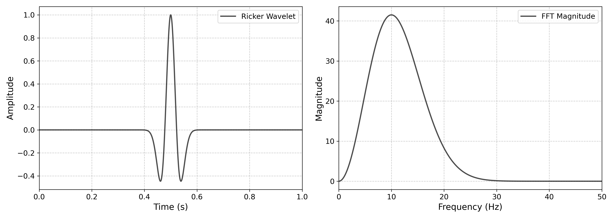
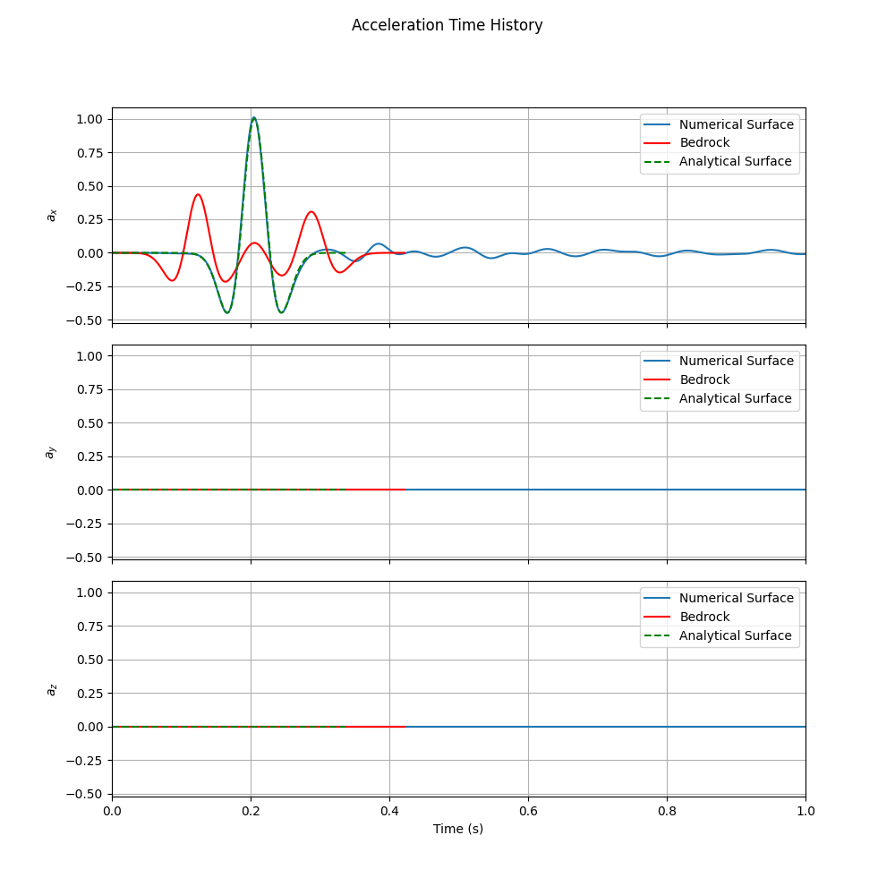
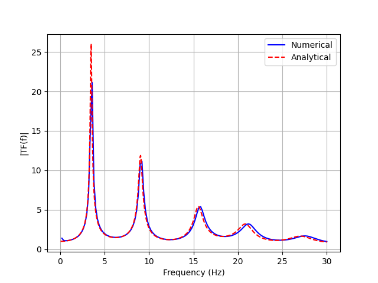

# Deconvolved Ricker-Wave Site Response

This example starts from a desired surface acceleration and calculates the base
motion required to reproduce it through an elastic layered soil profile.

<div class="tutorial-actions" markdown>
[:simple-googlecolab: Open in Colab](https://colab.research.google.com/github/GeotechUW/Femora/blob/main/examples/site_response/deconvolved_ricker_site_response.ipynb){ .tutorial-action .tutorial-action--colab target="_blank" rel="noopener" }
[:material-code-braces: View source](https://github.com/GeotechUW/Femora/blob/main/examples/site_response/deconvolved_ricker_site_response.py){ .tutorial-action .tutorial-action--source target="_blank" rel="noopener" }
</div>

| | |
|---|---|
| **Application** | One-dimensional site response |
| **Material behavior** | Layered linear elasticity |
| **Input workflow** | Surface target deconvolved to base motion |
| **Analysis** | Gravity followed by transient excitation |
| **Output** | VTKHDF displacement, velocity, and acceleration |
| **Execution** | Serial |

## From A Surface Target To A Base Input

A transfer function describes how a base motion is modified as it propagates
through the soil profile. In the frequency domain,

\[
A_{surface}(f) = H(f) A_{base}(f).
\]

When the desired surface motion is known, deconvolution reverses that mapping:

\[
A_{base}(f) = \frac{A_{surface}(f)}{H(f)}.
\]

The target in this example is a short Ricker pulse. Femora evaluates the
layered-soil transfer function, performs the inverse operation, and adds the
quiet lead-in and tail required for a stable time-domain base history.

<div class="femora-result-figure" markdown>

</div>

!!! note "Deconvolution is preprocessing"
    The target surface motion is not applied directly to the finite-element
    model. It defines the response to reproduce. The calculated base motion is
    the actual uniform-excitation input.

## Model

<div class="femora-embed">
  <iframe
    src="../../assets/examples/deconvolved-ricker-site-response/index.html"
    title="Interactive deconvolved Ricker-wave soil-column mesh"
    loading="lazy"
  ></iframe>
</div>

The finite-element model uses the same $1\text{ m} \times 1\text{ m}$,
$18\text{ m}$-deep layered profile as the elastic-column example. This keeps
the focus on the input-motion workflow rather than introducing a second soil
model at the same time.

## Worked Workflow

=== "1. Deconvolve the motion"

    Load the prescribed surface pulse, define the analytical soil and rock
    profile, and calculate the corresponding base motion.

    ```python
    --8<-- "examples/site_response/deconvolved_ricker_site_response.py:deconvolution"
    ```

=== "2. Build the model"

    The layer table creates the materials, brick elements, and mesh parts.

    ```python
    --8<-- "examples/site_response/deconvolved_ricker_site_response.py:model-and-mesh"
    ```

=== "3. Apply the base motion"

    Assembly forms the column, constraints enforce laminar behavior, and the
    generated base history becomes a uniform x-direction excitation.

    ```python
    --8<-- "examples/site_response/deconvolved_ricker_site_response.py:assembly-loading-and-output"
    ```

=== "4. Run the analysis"

    Femora establishes gravity, resets pseudo-time, and runs the transient
    Ricker-wave response.

    ```python
    --8<-- "examples/site_response/deconvolved_ricker_site_response.py:analysis-and-process"
    ```

## Results And Post-Processing

=== "Post-processing code"

    Run the maintained companion after OpenSees completes:

    ```powershell
    python examples/site_response/deconvolved_ricker_site_response_postprocess.py
    ```

    Femora's results API extracts the relative surface acceleration. The
    post-processor adds the imposed base acceleration to recover the absolute
    surface motion before comparing it with the target.

    ```python
    --8<-- "examples/site_response/deconvolved_ricker_site_response_postprocess.py:post-processing-workflow"
    ```

    ??? example "Complete post-processing source"
        ```python
        --8<-- "examples/site_response/deconvolved_ricker_site_response_postprocess.py"
        ```

=== "Surface response"

    The numerical absolute surface acceleration closely follows the prescribed
    Ricker pulse. The deconvolved base motion is also shown to make the complete
    inverse-and-forward workflow visible.

    <div class="femora-result-figure" markdown>
    
    </div>

=== "Transfer function"

    The numerical surface-to-base amplification reproduces the analytical
    layered-profile transfer function over the frequency range excited by the
    Ricker pulse.

    <div class="femora-result-figure" markdown>
    
    </div>

=== "Deformed response"

    The optional animation uses the same VTKHDF response to show amplified
    horizontal deformation through the three physical soil strata.

    <div class="femora-video">
      <video controls preload="metadata">
        <source src="../../assets/examples/deconvolved-ricker-site-response/response.mp4" type="video/mp4">
        Your browser does not support embedded MP4 video.
      </video>
    </div>

!!! info "Result provenance"
    These reference figures and the animation were produced by the validated
    legacy Example 4 benchmark. The migrated example preserves its profile,
    deconvolution input, integration parameters, and output quantities. Running
    the maintained source regenerates the same result types through the current
    Femora APIs.

## Run The Example

Use **Open in Colab** to execute preprocessing, model construction, OpenSees,
and static post-processing in sequence. Locally, export the model with:

```powershell
python examples/site_response/deconvolved_ricker_site_response.py
```

To execute OpenSees as well:

```powershell
$env:FEMORA_OPENSEES = "D:\path\to\OpenSees.exe"
python examples/site_response/deconvolved_ricker_site_response.py
```

The default output directory contains the generated base and aligned target
motions, exported Tcl model, solver results, and post-processing products.

??? example "Complete source"
    ```python
    --8<-- "examples/site_response/deconvolved_ricker_site_response.py"
    ```
