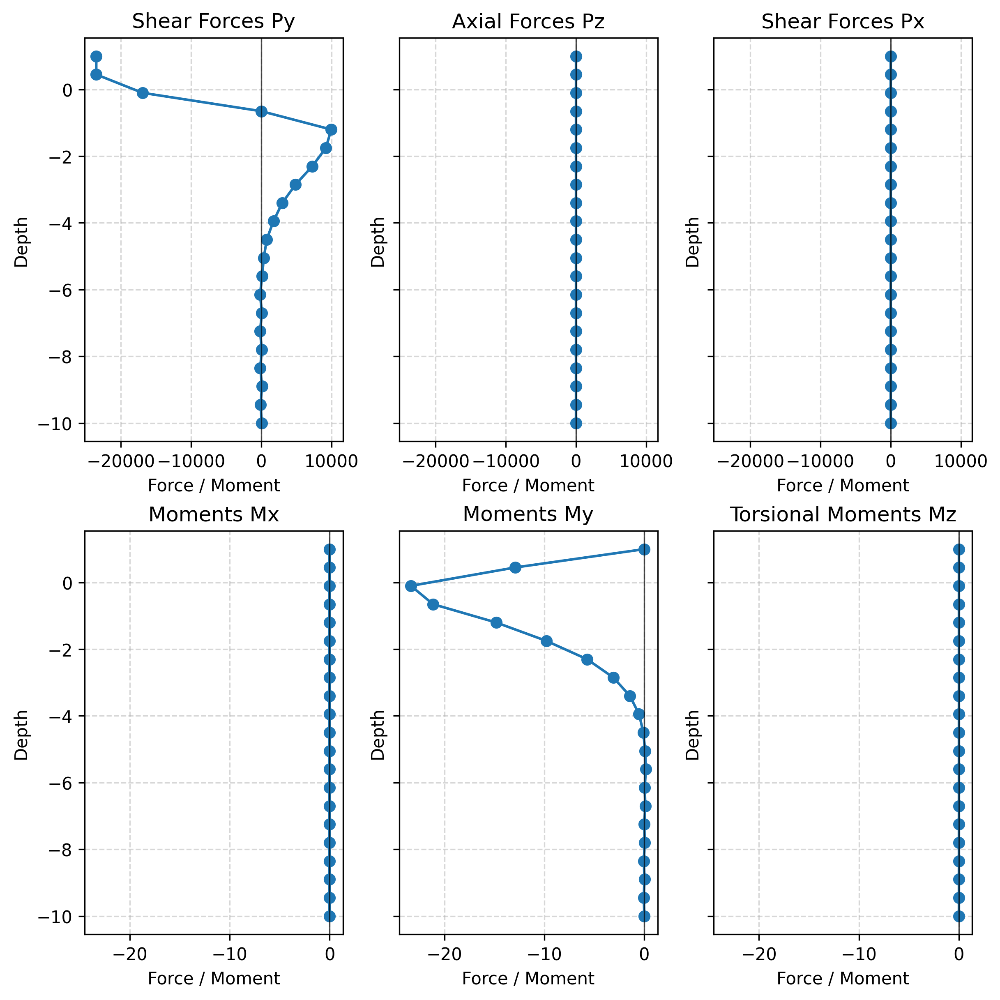

# Laterally Loaded Pile

This example embeds a circular beam-column pile in a graded three-dimensional
soil domain and applies a static horizontal load at the pile head.

<div class="tutorial-actions" markdown>
[:simple-googlecolab: Open in Colab](https://colab.research.google.com/github/GeotechUW/Femora/blob/main/examples/soil_structure_interaction/laterally_loaded_pile.ipynb){ .tutorial-action .tutorial-action--colab target="_blank" rel="noopener" }
[:material-code-braces: View source](https://github.com/GeotechUW/Femora/blob/main/examples/soil_structure_interaction/laterally_loaded_pile.py){ .tutorial-action .tutorial-action--source target="_blank" rel="noopener" }
</div>

| | |
|---|---|
| **Application** | Static pile-soil interaction |
| **Soil** | 3D elastic brick domain with geometric grading |
| **Pile** | 20 displacement-based beam-column elements from -10 m to 1 m |
| **Coupling** | Embedded beam-solid interface |
| **Loading** | 1 MN horizontal pile-head load |
| **Output** | Domain displacement and pile section forces |

## Model

<div class="femora-embed">
  <iframe
    src="../../assets/examples/laterally-loaded-pile/index.html"
    title="Interactive laterally loaded pile interface"
    loading="lazy"
  ></iframe>
</div>

The translucent grid is the complete soil domain. Orange cells are the
neighborhood selected by the embedded interface, the dark line is the pile
axis, and the blue envelope represents the circular pile radius used during
cell discovery. The pile continues above the ground surface so its loaded head
is not hidden by the soil mesh.

## Why The Domain Is Split Into Four Parts

The soil extends 8 m from the pile in both horizontal directions and 10 m below
the surface. Four geometric mesh parts meet at the pile axis. Their element
spacing grows toward the exterior boundaries, concentrating resolution where
pile-soil interaction is strongest without using the same fine spacing over
the full domain.

The four parts are assembled as one soil section with point merging enabled.
The pile is placed in a separate section because its nodes have six degrees of
freedom while the brick nodes have three. The embedded interface creates the
intended coupling; coincident point merging does not.

## Worked Workflow

=== "1. Grade the soil mesh"

    The four blocks use reciprocal grading ratios so cells remain compatible
    across the central planes and become larger away from the pile.

    ```python
    --8<-- "examples/soil_structure_interaction/laterally_loaded_pile.py:soil-domain"
    ```

=== "2. Define the pile"

    Circular section properties are calculated from the one-meter diameter,
    then passed to a displacement-based beam-column element with a `PDelta`
    transformation.

    ```python
    --8<-- "examples/soil_structure_interaction/laterally_loaded_pile.py:pile"
    ```

=== "3. Couple and assemble"

    The interface is declared first. During assembly it finds the solid cells
    crossed by the pile envelope and creates the embedded coupling data.

    ```python
    --8<-- "examples/soil_structure_interaction/laterally_loaded_pile.py:interface-and-assembly"
    ```

=== "4. Load and record"

    A geometric node mask selects the pile head. The beam-force recorder tracks
    all pile elements without requiring their solver tags in advance.

    ```python
    --8<-- "examples/soil_structure_interaction/laterally_loaded_pile.py:loading-and-output"
    ```

=== "5. Analyze"

    The static load is applied in 100 increments. A penalty handler enforces
    the interface constraints while Modified Newton solves each equilibrium
    step.

    ```python
    --8<-- "examples/soil_structure_interaction/laterally_loaded_pile.py:analysis-and-process"
    ```

## Results And Post-Processing

=== "Post-processing code"

    After OpenSees completes, run:

    ```powershell
    python examples/soil_structure_interaction/laterally_loaded_pile_postprocess.py
    ```

    The postprocessor reads the XML beam-force recorder and reconstructs the
    force and moment distributions from the pile toe to its head. It also reads
    the VTKHDF displacement history and creates a complete-model deformation
    movie. The movie shows static load progression, so its annotation reports
    load factor rather than physical time.

    ```python
    --8<-- "examples/soil_structure_interaction/laterally_loaded_pile_postprocess.py:post-processing-workflow"
    ```

    ??? example "Complete post-processing source"
        ```python
        --8<-- "examples/soil_structure_interaction/laterally_loaded_pile_postprocess.py"
        ```

=== "Pile forces and moments"

    This archived benchmark figure is retained from the legacy example so the
    migration does not require another solver run. The six distributions check
    the dominant lateral shear and bending response and expose unintended
    out-of-plane or torsional force. Regenerate it with the maintained
    postprocessor when current analysis results are available.

    <div class="femora-result-figure" markdown>
    
    </div>

=== "Deformed response"

    The animation shows the complete soil-pile model as the lateral load is
    applied. The soil mesh remains visible while the pile is overlaid as a
    dark line, making the relative deformation and pile position easy to
    inspect. The annotation reports load factor because this is a static
    analysis.

    <div class="femora-video">
      <video controls preload="metadata">
        <source src="../../assets/examples/laterally-loaded-pile/lateral-deformation.mp4" type="video/mp4">
        Your browser does not support embedded MP4 video.
      </video>
    </div>

## Run The Example

For local model export:

```powershell
python examples/soil_structure_interaction/laterally_loaded_pile.py
```

To execute OpenSees as well:

```powershell
$env:FEMORA_OPENSEES = "D:\path\to\OpenSees.exe"
python examples/soil_structure_interaction/laterally_loaded_pile.py
```

??? example "Complete source"
    ```python
    --8<-- "examples/soil_structure_interaction/laterally_loaded_pile.py"
    ```
