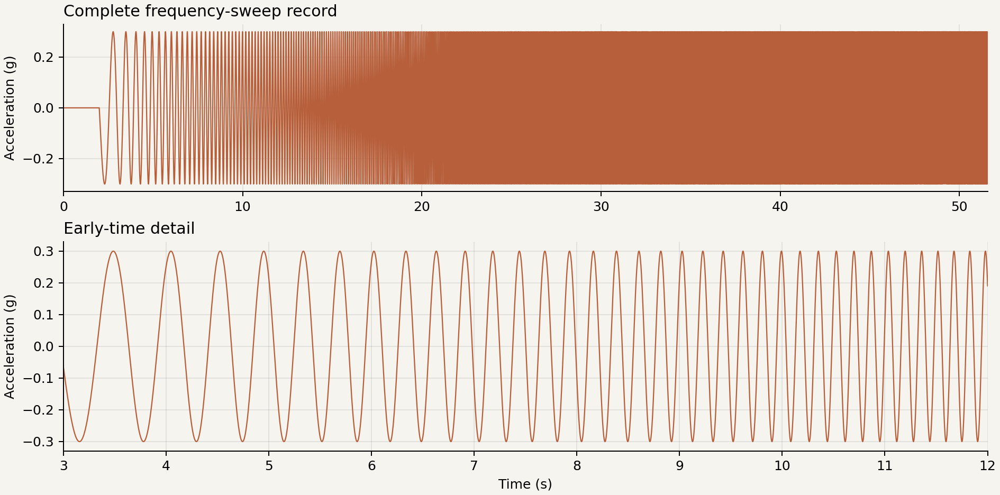

# Layered Elastic Soil Column

This example models the one-dimensional response of a five-layer elastic soil
profile subjected to a horizontal frequency-sweep excitation.

<div class="tutorial-actions" markdown>
[:simple-googlecolab: Open in Colab](https://colab.research.google.com/github/GeotechUW/Femora/blob/main/examples/site_response/layered_elastic_soil_column.ipynb){ .tutorial-action .tutorial-action--colab target="_blank" rel="noopener" }
[:material-code-braces: View source](https://github.com/GeotechUW/Femora/blob/main/examples/site_response/layered_elastic_soil_column.py){ .tutorial-action .tutorial-action--source target="_blank" rel="noopener" }
</div>

| | |
|---|---|
| **Application** | One-dimensional site response |
| **Material behavior** | Layered linear elasticity |
| **Analysis** | Gravity followed by transient excitation |
| **Boundary condition** | Laminar column with a fixed base |
| **Output** | VTKHDF displacement, velocity, and acceleration |
| **Execution** | Serial |

## Model

<div class="femora-embed">
  <iframe
    src="../../assets/examples/layered-elastic-soil-column/index.html"
    title="Interactive layered elastic soil-column mesh"
    loading="lazy"
  ></iframe>
</div>

The $1\text{ m} \times 1\text{ m}$ column extends from $z=-18\text{ m}$ to the
ground surface. Each color identifies a material layer. Nodes at each elevation
are tied with laminar constraints, so the narrow 3D mesh reproduces
one-dimensional shear-wave propagation while retaining brick elements.

### Applied motion

The base acceleration is a frequency sweep whose frequency increases with
time. This makes the model pass through a broad frequency range in one analysis
and exposes the profile's principal amplification peaks.



## Soil Profile

| Layer | Thickness (m) | $G$ (MPa) | Unit weight (kN/m$^3$) | $V_s$ (m/s) | Element height (m) |
|---|---:|---:|---:|---:|---:|
| Dense Ottawa, lower | 2.6 | 145 | 19.9 | 267.36 | 1.3 |
| Dense Ottawa, middle | 2.4 | 145 | 19.9 | 267.36 | 1.2 |
| Dense Ottawa, upper | 5.0 | 145 | 19.9 | 267.36 | 1.0 |
| Loose Ottawa | 6.0 | 75 | 19.1 | 196.27 | 0.5 |
| Dense Monterey | 2.0 | 42 | 19.8 | 144.25 | 0.5 |

The source uses a consistent kN-m-s unit system. It converts the tabulated SI
stiffness and mass density before creating each Femora material.

## Response

The animation shows the amplified horizontal deformation of the finite-element
column during the frequency sweep. Colors identify the three physical soil
strata; the first three mesh parts in the source form the single 10 m Dense
Ottawa stratum.

<div class="femora-video">
  <video controls preload="metadata">
    <source src="../../assets/examples/layered-elastic-soil-column/response.mp4" type="video/mp4">
    Your browser does not support embedded MP4 video.
  </video>
</div>

The numerical surface-to-base amplification follows the analytical layered-soil
transfer function, including the principal resonance peaks.


## Key Model Definitions

=== "Layers and mesh"

    Each layer creates its own material, brick element, and mesh part from the
    profile table.

    ```python
    --8<-- "examples/site_response/layered_elastic_soil_column.py:layered-mesh"
    ```

=== "Assembly and boundaries"

    Assembly joins the independently generated layers. Laminar constraints tie
    equal-elevation boundary nodes, and the base restrains all translations.

    ```python
    --8<-- "examples/site_response/layered_elastic_soil_column.py:assembly-and-constraints"
    ```

=== "Excitation and output"

    A nonuniform Path time series drives a uniform x-direction excitation. The
    VTKHDF recorder writes the full transient field response every (0.01) s.

    ```python
    --8<-- "examples/site_response/layered_elastic_soil_column.py:excitation-and-output"
    ```

=== "Analysis stages"

    The process establishes gravity, activates the excitation and recorder,
    resets pseudo-time, and then runs the transient response.

    ```python
    --8<-- "examples/site_response/layered_elastic_soil_column.py:analyses-and-process"
    ```

## Run The Example

Use **Open in Colab** to run the complete model in a prepared browser runtime.
The generated setup cell installs Femora, configures OpenSees, and downloads
only the two required motion files.

For a local export:

```powershell
python examples/site_response/layered_elastic_soil_column.py
```

To execute OpenSees as well:

```powershell
$env:FEMORA_OPENSEES = "D:\path\to\OpenSees.exe"
python examples/site_response/layered_elastic_soil_column.py
```

A local export reports:

```text
Layered elastic soil column
  Nodes:       104
  Elements:    25
  Tcl model:   .../layered_elastic_soil_column.tcl
```

The default `example_outputs/layered_elastic_soil_column/` directory contains
the OpenSees Tcl model and, after solver execution, the recorded VTKHDF
response.

??? example "Complete source"
    ```python
    --8<-- "examples/site_response/layered_elastic_soil_column.py"
    ```
