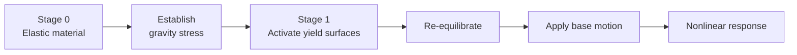
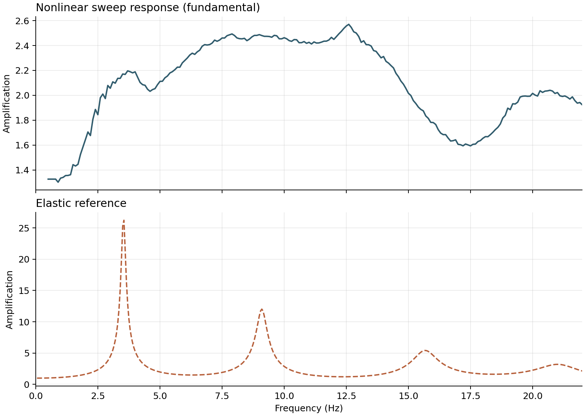
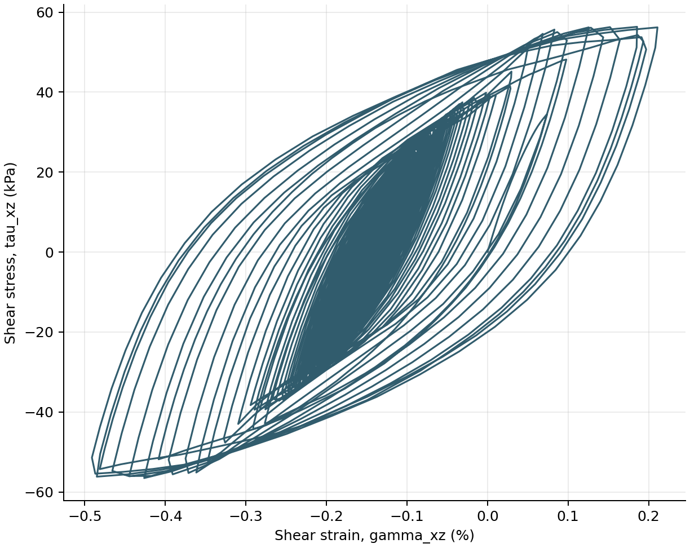

# Nonlinear Layered Soil Column

This example extends the layered elastic column with staged
`PressureDependMultiYield` materials and amplitude-dependent sand response.

<div class="tutorial-actions" markdown>
[:simple-googlecolab: Open in Colab](https://colab.research.google.com/github/GeotechUW/Femora/blob/main/examples/site_response/nonlinear_layered_soil_column.ipynb){ .tutorial-action .tutorial-action--colab target="_blank" rel="noopener" }
[:material-code-braces: View source](https://github.com/GeotechUW/Femora/blob/main/examples/site_response/nonlinear_layered_soil_column.py){ .tutorial-action .tutorial-action--source target="_blank" rel="noopener" }
</div>

| | |
|---|---|
| **Application** | One-dimensional nonlinear site response |
| **Material behavior** | Pressure-dependent multi-yield sand plasticity |
| **Analysis sequence** | Elastic gravity, plastic staging, transient excitation |
| **Nonlinear solution** | Newton line search with Newmark integration |
| **Output** | Motion, stress, strain, and deformation histories |
| **Execution** | Serial |

## Why Material Staging Matters

The soil must begin the earthquake analysis in equilibrium under its own
weight. Activating plasticity before gravity is established can introduce
unwanted yielding while the initial stress state is still forming.

Femora therefore separates initialization from dynamic response:



The geometry does not change between stages. Femora changes how the registered
materials respond and then continues with the same assembled finite-element
domain.

## Model

<div class="femora-embed">
  <iframe
    src="../../assets/examples/nonlinear-layered-soil-column/index.html"
    title="Interactive nonlinear layered soil-column mesh"
    loading="lazy"
  ></iframe>
</div>

The column retains the geometry and initial elastic stiffness of the earlier
elastic benchmark. That makes differences in amplification and energy
dissipation attributable to material nonlinearity rather than a changed mesh.

## Soil Profile

| Stratum | Thickness (m) | $G_{ref}$ (MPa) | Unit weight (kN/m$^3$) | Friction angle |
|---|---:|---:|---:|---:|
| Dense Ottawa | 10.0 | 145 | 19.9 | 40 degrees |
| Loose Ottawa | 6.0 | 75 | 19.1 | 29 degrees |
| Dense Monterey | 2.0 | 42 | 19.8 | 40 degrees |

The OpenSees material expects one consistent unit system. The source converts
the tabulated moduli from Pa to kPa and density from kg/m$^3$ to Mg/m$^3$
before creating the material objects.

The frictional, contraction, dilation, and cyclic-mobility parameters use the
OpenSees loose- and dense-sand families as starting values. They are not a
substitute for calibration against laboratory or site-specific response data.

!!! note "Drainage assumption"
    `stdBrick` elements with `PressureDependMultiYield` represent drained soil
    response. Undrained or partially drained response requires coupled `u-p`
    elements, pore-pressure degrees of freedom, and calibrated permeability.

!!! note "Three materials, five mesh parts"
    The Dense Ottawa stratum is split into three mesh parts to control vertical
    discretization, but all three parts reference the same physical nonlinear
    material. Mesh organization and material identity remain separate choices.

## Worked Workflow

=== "1. Define nonlinear materials"

    Each physical stratum receives reference shear and bulk moduli, density,
    strength parameters, and twenty nested yield surfaces.

    ```python
    --8<-- "examples/site_response/nonlinear_layered_soil_column.py:nonlinear-materials"
    ```

=== "2. Build and assemble"

    Five independently discretized mesh parts form one merged laminar column.

    ```python
    --8<-- "examples/site_response/nonlinear_layered_soil_column.py:mesh-and-assembly"
    ```

=== "3. Define loading and output"

    The frequency sweep drives the base while VTKHDF records nodal motion and
    six-component element stress and strain.

    ```python
    --8<-- "examples/site_response/nonlinear_layered_soil_column.py:loading-and-output"
    ```

=== "4. Stage and analyze"

    The process makes the elastic-to-plastic transition explicit. Newton line
    search handles the nonlinear equilibrium iterations during the response.

    ```python
    --8<-- "examples/site_response/nonlinear_layered_soil_column.py:staging-and-analysis"
    ```

## Results And Post-Processing

=== "Post-processing code"

    Run the maintained companion after OpenSees completes:

    ```powershell
    python examples/site_response/nonlinear_layered_soil_column_postprocess.py
    ```

    ```python
    --8<-- "examples/site_response/nonlinear_layered_soil_column_postprocess.py:post-processing-workflow"
    ```

    ??? example "Complete post-processing source"
        ```python
        --8<-- "examples/site_response/nonlinear_layered_soil_column_postprocess.py"
        ```

=== "Amplification"

    `nonlinear-amplification.png` follows the frequency sweep in time and fits
    the fundamental surface response locally at each excitation frequency. It
    is not a linear transfer function: yielding generates harmonics and makes
    the response depend on loading history, so its peaks are expected to be
    broader and lower than the elastic reference.

    <div class="femora-result-figure" markdown>
    
    </div>

=== "Material hysteresis"

    `shear-hysteresis.png` extracts the $xz$ stress-strain history from a
    representative Loose Ottawa element. Closed loops show hysteretic energy
    dissipation that is absent from the elastic benchmark.

    <div class="femora-result-figure" markdown>
    
    </div>

=== "Deformed response"

    The optional `response.mp4` animation shows amplified horizontal
    deformation at physical scale while preserving the physical-stratum colors
    used throughout the site-response examples.

    <div class="femora-video">
      <video controls preload="metadata">
        <source src="../../assets/examples/nonlinear-layered-soil-column/response.mp4" type="video/mp4">
        Your browser does not support embedded MP4 video.
      </video>
    </div>

## Run The Example

Use **Open in Colab** for the complete browser workflow. A nonlinear analysis
is more expensive than the elastic examples because equilibrium must be checked
at every time step.

For local export:

```powershell
python examples/site_response/nonlinear_layered_soil_column.py
```

To execute OpenSees as well:

```powershell
$env:FEMORA_OPENSEES = "D:\path\to\OpenSees.exe"
python examples/site_response/nonlinear_layered_soil_column.py
```

The solver run writes VTKHDF fields under
`example_outputs/nonlinear_layered_soil_column/results/`. Femora reports the
analysis step immediately if nonlinear equilibrium cannot be reached.

??? example "Complete source"
    ```python
    --8<-- "examples/site_response/nonlinear_layered_soil_column.py"
    ```
