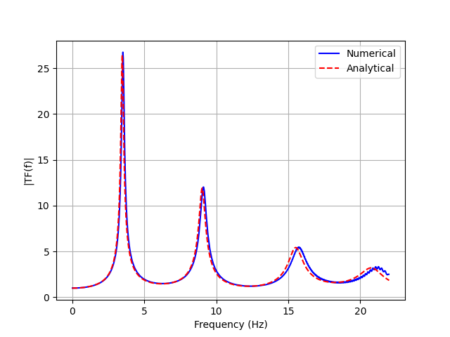

# Partitioned Layered Soil Domain

This example expands the layered column into a three-dimensional soil domain
and uses METIS to divide its finite-element cells among eight processor domains.

<div class="tutorial-actions" markdown>
[:simple-googlecolab: Open in Colab](https://colab.research.google.com/github/GeotechUW/Femora/blob/main/examples/site_response/partitioned_layered_soil_domain.ipynb){ .tutorial-action .tutorial-action--colab target="_blank" rel="noopener" }
[:material-code-braces: View source](https://github.com/GeotechUW/Femora/blob/main/examples/site_response/partitioned_layered_soil_domain.py){ .tutorial-action .tutorial-action--source target="_blank" rel="noopener" }
</div>

| | |
|---|---|
| **Application** | Three-dimensional layered site response |
| **Domain** | $10\text{ m} \times 10\text{ m} \times 18\text{ m}$ |
| **Mesh** | 2,500 brick elements and 3,146 nodes |
| **Partitioning** | Eight connected METIS subdomains |
| **Analysis** | Gravity followed by frequency-sweep excitation |
| **Output** | Distributed VTKHDF response |

## Partitioned Model

<div class="femora-embed">
  <iframe
    src="../../assets/examples/partitioned-layered-soil-domain/index.html"
    title="Interactive partitioned layered soil-domain mesh"
    loading="lazy"
  ></iframe>
</div>

Each color is a core assignment stored on the assembled cells. The colors do
not represent materials: the five vertical mesh parts still describe the same
three physical soil strata used by the column example.

## From Column To Domain

The material profile, damping, vertical element sizes, base motion, and laminar
constraints remain unchanged. Expanding the horizontal grid from one brick per
elevation to 100 bricks per elevation creates a model large enough to illustrate
domain decomposition while preserving one-dimensional free-field behavior.

=== "Domain mesh"

    ```python
    --8<-- "examples/site_response/partitioned_layered_soil_domain.py:model-and-mesh"
    ```

=== "Partitioning and constraints"

    ```python
    --8<-- "examples/site_response/partitioned_layered_soil_domain.py:partition-and-constraints"
    ```

=== "Loading and analysis"

    ```python
    --8<-- "examples/site_response/partitioned_layered_soil_domain.py:analysis"
    ```

## Response

The amplified deformation below shows the uniform horizontal response across
the wider domain and the propagation of motion through the layered profile.

<div class="femora-video">
  <video controls preload="metadata">
    <source src="../../assets/examples/partitioned-layered-soil-domain/response.mp4" type="video/mp4">
    Your browser does not support embedded MP4 video.
  </video>
</div>



## Run The Example

```powershell
python examples/site_response/partitioned_layered_soil_domain.py
```

The default run builds and exports all eight partitions but does not launch the
solver. Parallel execution requires an MPI-enabled OpenSees runtime. To inspect
the same domain in forced-serial mode, set:

```powershell
$env:FEMORA_EXAMPLE_PARTITIONS = "0"
python examples/site_response/partitioned_layered_soil_domain.py
```

??? example "Complete source"
    ```python
    --8<-- "examples/site_response/partitioned_layered_soil_domain.py"
    ```
